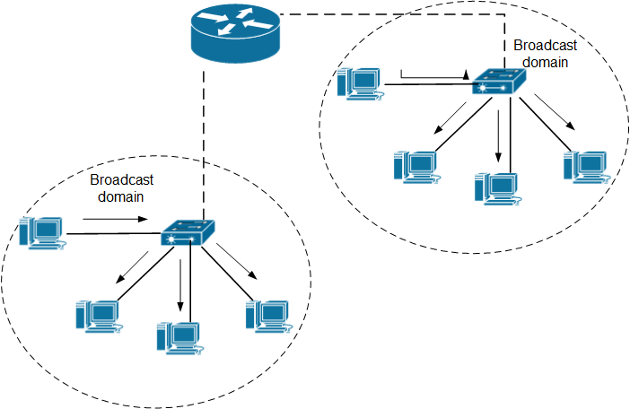
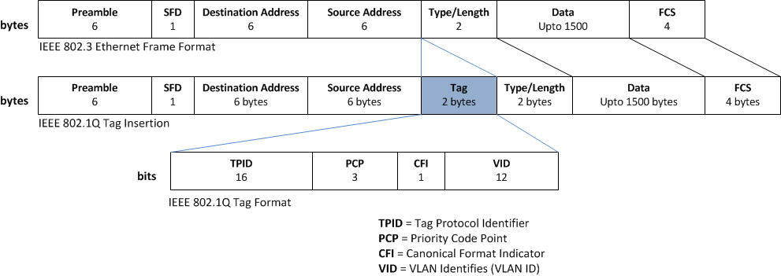
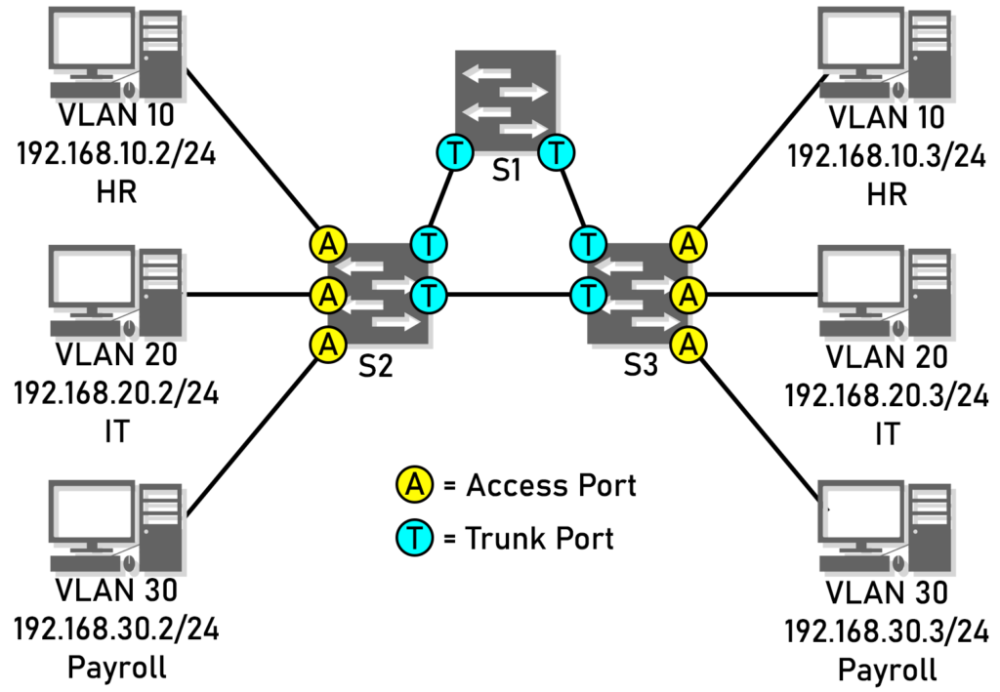
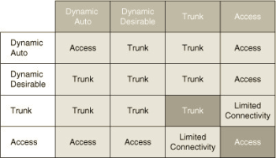
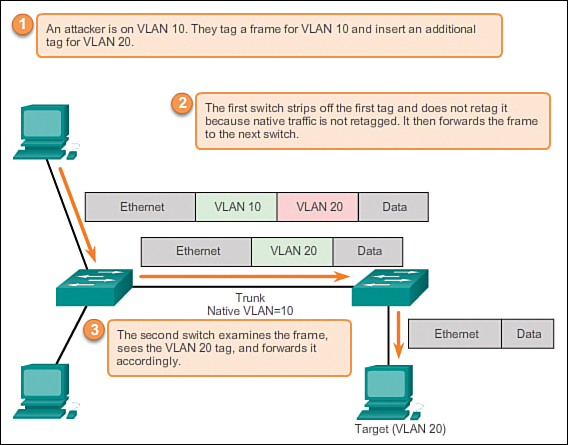
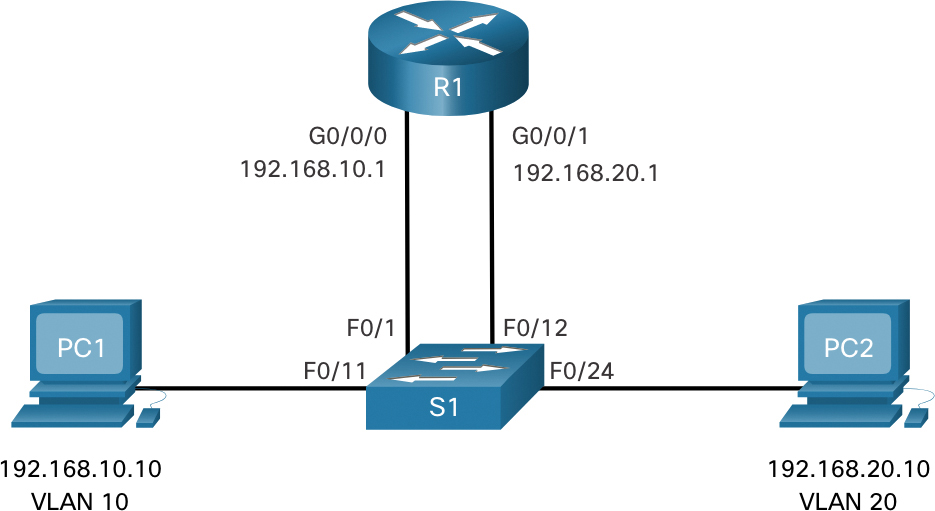
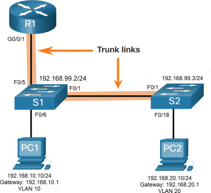

OSI 2 - Linková vrstva - VLAN - princip, použití. trunk/access porty, DTP, protokol 802.1q
===

Přehled
---
Opět velmi jednoduchá otázka, dá se o ní mluvit dlouho, témata jsou jasná.

Povídání
---
Takže v první řadě, proč vůbec VLANy potřebujeme. Well, existuje tzv. **broadcast domain**. Broadcastová doména je část sítě, které bude vyslána broadcastová zpráva, pokud ji nějaké zařízení vyšle. Na malých sítích není takový problém mít celou síť jako jednu velkou broadcast doménu. Nicméně na velké síti s několika odděleními to může být problém. Síť může být přehlcena a zpomalena. A má to samozřejmě i dopady na bezpečnost sítě.       
Implementace **VLAN** (Virtual Local Area Network) efektivně řeší tento problém. Virtuálně rozdělí síť na několik broadcastových domén. Důležité je poznamenat, že ji rozdělí na L2.

Teď, když jsme si vysvětlili, proč VLANy potřebujeme, si povíme, jak se liší normální ethernetový header s tím, který využívá VLANy. Liší se jednou věcí, při využití VLANů, je rámec otaggován **802.1q taggem**. Tento standart opět vyvinulo IEEE. Rámec je otaggován až potom, co přijde do switche. Když z něj odchází, je opět odtaggován, protože koncová zařízení taggům nerozumí a mohla by rámec zahodit.     
Podíváme se teď na samotný **802.1q tag**:

Má 4 byty a je vložen mezi Source MAC a Type pole. Je rozdělen na dvě části. **TPID** a **TCI**. TPID (Tag Protocol Identifier) má vždy hodnotu 0x8100. Tím rámec identifikuje jako IEEE 802.1q otaggován. TCI (Tag Control Information) je rozdělen na tři další části. **PCP** (Priority Code Point) a **DEI** (Drop Eligible Indicator) mají co dělat s IEEE 802.1p class of service (CoS), takže se jimi nemusíme moc zabývat. PCP má 3 bity a může být využito k označení prioritných rámců v kritických sítích. DEI má 1 bit a může sloužit jako indikace, že rámec může být v případě přehlcení sítě zahozen. Poslední podpole, pro nás to nejdůležitější, je **VID** (VLAN Identifier). Má 12 bitů, může tedy nabývat hodnot od 0 - 4095. Je to prostě číslo našeho VLANu.      
VLAN 0 a 4095 jsou rezervované, takže máme k dispozici celkem **4094 VLANů**, což je více než dost. Prvních 1006 VLANů je označovaných jako **normal VLANs**. Určitě jste se již setkali s tím, že i po restartování switche ve škole byly přítomny nějaké VLANy, které jste rozhodně nevytvořili. To je tím, že právě normální VLANy jsou uloženy na Cisco zařízeních v souboru **vlan.dat**, který po restartu switche nemaže. Ostatní VLANy jsou označovány jako **extended VLANy**. Na Cisco zařízeních jsou uloženy normálně v running configu.      
Další věc, kterou probereme, je rozdíl mezi **access portem a trunkem**. Když konfigurujeme VLANy na síti, přiřazujeme VLAN k portům na switchy. V realitě je na každém portu vždy nastaven nějaký VLAN, **defaultně VLAN 1**. Nastavení VLANu na jednotlivých portech můžeme změnit, nastavit na nějakém portu třeba VLAN 10. Portům, kde je nastaven pouze jeden VLAN, a které se tím pádem netaggují, tzn. když je tím portem odesílán rámec, je z něj nejdříve odstraněn tag, se říká access porty. Předpokládá se totiž, že na druhém konci tohoto linku se nachází třeba stolní počítač, nebo jiné koncové zařízení, které tagům nerozumí. **Access port by tedy měl vždy vést jen a pouze ke koncovému zařízení**.       
Nu, ale co když chceme, aby po lince mohlo běhat více VLANů? Třeba když máme mezi sebou propojené dva switche a potřebujeme, aby mezi nimi fungovala komunikace přes několik VLANů. Pak přichází na řadu tzv. **trunk port**. Trunk port dovoluje specifikovat, jaké VLANy přes něj mohou putovat. **Měl by být nastaven vždy jen a pouze mezi síťovými zařízeními**, tj. switch, router, .. Při cestě přes trunk musí být rámec otaggován, aby přijímající síťové zařízení vědělo, z jakého VLANu rámec přišel.       
Na trunk portu existuje také koncept **native VLANu**. Defaultně opět VLAN 1, lze však změnit. Pokud se rámec nachází v tomto VLANu, switch ho neotaguje, když prochází přes trunk. Je tudíž potřeba nastavit stejný native VLAN na všech trunk portech, v opačném případě mohou vznikat zvláštní problémy v síti.      

Otázka zmiňuje také protokol **DTP** (Dynamic Trunking Protocol). Tento protokol je Cisco specifický protokol, který má síťařům usnadnit práci. Stará se o automatické vytváření trunků. Na Cisco zařízeních na defaultně povolen na všech portech. Port může být nastaven do módu **Dynamic Auto**. V tomto módu port pouze čeká, jestli s ním někdo nezačne domlouvat trunk. Pokud jsou proti sobě tedy dva dynamic auto porty, zůstane mezi nimi access port. Další možností je **Dynamic Desirable**. V tomto módu se port snaží aktivně vyjednat trunk port. Jediný případ, ve kterém trunk port nevyjedná úspěšně, je, pokud je druhý port linky nastaven staticky na access port. Dalšími možnostmi tedy logicky jsou, statické nastavení portu na trunk, nebo access. V tabulce níže vidítě jak se chovají všechny různé kombinace na lince.

Ukážeme si další protokol spojený s VLANy, tento ale na maturitu potřebovat spíš nebudete. Nicméně kvůli úplnosti ho zde zahrnu. Je to **VTP** (Virtual Trunking protocol). Tento protokol byl vytvořen speciálně pro velké sítě, kde by mohlo být složité a otravné udržovat tabulku VLANu na každém switchy aktuální. Slouží tedy k synchronizaci VLAN tabulky mezi switchy na síti. V moderních sítích je využit jen zřídka. Má tři verze, mu budeme brát v potaz pouze tu třetí, rozdíly nás nemusí zajímat.        
Pokud využíváme VTP, každý switch může být buď **klient, server, nebo trasparentní**. Server vysílá advertisementy se svou VLAN tabulkou a revizním číslem, to je aktuálnost tabulky. Zvyšuje se s každou změnou tabulky. Klient synchronizuje svou tabulku na základě advertismentu s nejvyšším revizním číslem. Zajímavostí je, že to samé dělá i server, pokud dostane advertisment s vyšším revizním číslem, než je to jeho. Klient také nemůže sám měnit svou tabulku VLANů. Advertisementy se vysílají jen a pouze na truncích.       
VTP také využívá tzv. **VTP domény**. Defaultně není žádný switch v žádné doméně. To můžeme změnit. Pokud nastavíme doménu na serveru, všechny switche, které dostanou advertisement s toutou doménou, se do ní automaticky přidají, pokud ještě nemají doménu nastavenou.      
**Transparentní** switch může svou tabulku VLANů měnit dle libosti a nikam ji nevysílá, ani nepřijímá advertisementy od serveru, posílá je však dál.        
Proč by měl tento protokol jakkoliv škodit? Nu, mějme situaci, kdy do sítě zapojíme starší switch a zapomeneme, že revizní číslo v jeho VLAN tabulce je vyšší, než číslo našeho VTP serveru. Každý switch defaultně předpokládá, že je VTP server. Tento switch tedy rozešle advertisement se svou tabulkou a všechny klienti i servery v naší VTP doméně se podle něj přizpůsobí .. no a tím jsme si efektivně rozesrali všechny VLANy na síti, protože kdo ví, co za VLANy bylo na tom starším switchy.

Uděláme si takové rychlé okénko do VLAN bezpečnosti. Sice to pravděpodobně nebudete pro maturitu potřebovat, můžete se tím trochu zachránit v případě, že by vám došly slova, nebo jste něco zapomněli. První zásadní věc, která se dělá vždy a všude. **Vypnout DTP na všech portech, které jsou určeny koncovým zařízením**. Nebo klidně rovnou úplně na všech a trunky nastavit staticky. Proč? Dnes je pro počítač možné, aby se prezentoval jako switch a vytvořil s opravdovým switchem trunk port. Útočník, který by této slabiny využil, by byl schopný posílat data do všech VLANů a vidět data ze všech VLANů. Tomuto útoku se říká **Switch Spoofing**.     
Další důležitou věcí je **dát všechny nepoužívané porty do nevyužívaného VLANu a natvrdo vypnout**.     
Poslední bezpečnostní opatření, které bychom měli implementovat, když mluvíme o VLANech, je **nastavit native VLAN na všech trunk portech na nějaký náhodný VLAN, který není nikde jinde použit**. Výsledkem by mělo být, že nikde již nevyužíváme VLAN 1. Vysvětlím. Druhým útokem, který je spojený s VLANy, je tzv. **VLAN double tagging**. Útočník musí nejdříve být připojen k portu, který je zároveň přiřazen native VLANu, který je nastaven na trunku, který chce útočník přejít. Útočník vytvoří speciální packet, který má dva tagy. První je pro VLAN útočníka, tedy native VLAN na trunku. Druhý je VLAN, na kterém je zařízení, ke kterému se chce útočník dostat na druhé straně trunku. Ten pak vyšle. První switch odstraní první header, protože je to native VLAN a přes trunk přechází neotaggován. Druhý switch uvidí druhý header, odstraní ho a vyšle ho příslušnému zařízení. Tento útok funguje jenom jedním směrem, žádná zpráva se již nedostane zpět k útočníkovi, proto je dobrý pro DoS útoky.

Poslední věc, kterou si řekneme, ačkoliv není specifikována v otázce, je **routování mezi VLANy**. K L3 se teprve dostaneme, nicméně VLANy již nejsou zmíněny v žádné další otázce, takže si je dopovíme. Možná vám to došlo, možná ne, nicméně pokud jsou dva počítače na jedné síti ve dvou různých VLANech, nemají, jak spolu komunikovat. Musíme mezi ně dát směrovač, router, který bude mezi VLANy routovat.          
První, logická možnost, je, že **prostě pro každý VLAN využijeme port na routeru**. No .. routery moc portů nemívají a zbytečně bychom tak několik ztratily. A na routovaní mezi více jak třeba čtyřmi VLANy můžete taky zapomenout. Nicméně to opravdu kdysi dávno bylo implementováno. Dnes již naštěstí máme lepší možnosti.              

Druhou možností je tzv. **ROS** (Router on a Stick). Budeme mu poeticky říkat, směrovač na klacku. Tento způsob je hojně využíván v malých sítích, protože je velmi jednoduché ho nakonfigurovat a nevyžaduje žádný přidaný hardware. Mezi routerem a switchem vytvoříme trunk, přes který budeme posílat všechny VLANy, mezi kterými chceme routovat. Na routeru vytvoříme pro každý VLAN subinterface, tedy jakýsi virtuální podinterface portu, ke kterému je trunk připojen. Každému podinterfacu přidělíme IP adresu podle toho, jakou síť daný VLAN využívá, a máme to.

Poslední možností, kterou nebudeme probírat, nicméně se hodí vědět o její existenci, je využití **SVI** (Switch Virtual Interface) na L3 switchy. To je switch, který je L3 aware, tj. rozumí IP adresám, dovede směrovat atd. Tento typ routování mezi VLANy je nejefektivnější a využívá se v sítích, na které jsou vyšší nároky.

Materiály
---
Jeremy's IT Lab - VLANs (Part 1) - https://www.youtube.com/watch?v=cjFzOnm6u1g       
Jeremy's IT Lab - VLANs (Part 2) - https://www.youtube.com/watch?v=Jl9OOzNaBDU       
Jeremy's IT Lab - VLANs (Part 3) - https://www.youtube.com/watch?v=OkPB028l2eE      
Jeremy's IT Lab - DTP/VTP - https://www.youtube.com/watch?v=JtQV_0Sjszg         
Professor Messer - VLAN Hopping - https://www.youtube.com/watch?v=pDumMKDK4Wc