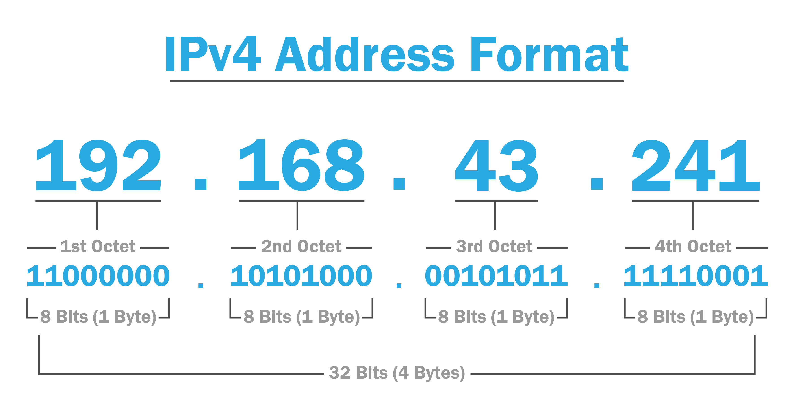

OSI 3 - Síťová vrstva - IPv4, maska, podsíťování, porovnání s IPv6, fragmentace
===

Přehled
---
Docela pěkná otázka, IPv4 je jednoduché téma, ačkoliv podsíťování může vypadat trochu komplikovaně.

Povídání
---
Dostáváme se teď na třetí síťovou vrstvu, ta má příhodný název .. síťová. Budeme o ní tedy pro přehlednost referovat jako o **L3**. Operuje na ní typicky protokol IP. Pro naše potřeby nemusíme jiný L3 protkol znát a je také jediný, u kterého si ukážeme header. Na této vrstvě operuje především zařízení, kterému říkáme **směrovač, router**. Rozděluje sítě, tím rozděluje i broadcast domény. Má několik portů, každý port mívá svou síťovou kartu, tudíž i MAC adresu a měl by mít nastevenou i IP adresu pro příslušnou síť. Uchovávají si také směrovací tabulku, na základě které směrují pakety. Touto tabulkou se budeme blíže zabývat v otázce o směrování.      
Každé zařízení, které by se chtělo dostat na internet, musí zaslat takové pakety na svůj lokální router. Tomuto směrovači se říká **default gateway**, v češtině výchozí brána. Tou je IP adresa síťové karty, která obstarává port, ke kterému je daná síť připojena.

Na linkové vrstvě jsme měli MAC adresy. Na L3 zařízení unikátně identifikuje **IP adresa**. Má 32 bitů a zapisuje se zpravidla v tzv. **dotted-decimal** formátu. Každý byte je oddělen tečkou a převeden do desítkové soustavy. To je velmi pěkně vidět na obrázku. Důležité je si uvědomit, že IP adresa je především binární, toho totiž využijeme, až si budeme říkat o podsíťování. Je tedy tečkami rozdělena do čtyř částí. Každá část může nabývat jednou z 256 hodnot, tedy 0-255. IPv4 adresa je ještě rozdělena na síťovou a uživatelskou část. Ta je dána maskou. Síťová část unikátně identifikuje síť, uživatelská část uživatele na dané síti. O masce si povíme více dále.      

Dříve byly IP adresy rozděleny do tříd (A, B, C, D, E). Netřeba si vysvětlovat tento princip, protože dnes se již používá **CIDR** (Classless Inter Domain Routing). Zanedbáme teoretickou definici CIDRu, stačí nám vědět, že něco takového existuje. Předtím, než si ukážeme jednotlivé typy IP adres, je potřeba si něco uvědomit. IPv4 adres je omezená množství, asi **4 miliardy**. To je méně, než je lidí na zemi. Takže IPv4 adresy už **v podstatě došli**. S tímto problémem se snaží bojovat hned několik technologií. Jednou z nich je **NAT**, který si probereme v příslučné otázce. Dalším je **rozdělení IPv4 adres** do **private** a **public** prostoru. Každopádně dlouhodobě tato strategie nemůže fungovat a třeba NAT způsobuje i některé problémy.         
Nicméně zde vstupuje na scénu **IPv6**. O tom, jak vypadá IPv6 adresa si řekneme v další otázce, nicméne jich je značně a mnohem více .. **2 na 128**. To nám ještě hodně dlouho nedojde. Ačkoliv globální implementace IPv6 postupuje, je velmi pozvolná. To je dané značným množstvím zařízení na internetu, které stále pracují pomocí zásadně IPv4. Právě z tohoto důvodu se ani poskytovatelé nehrnout do plného přechodu na IPv6. Ale dřív, nebo později to prostě přijít musí.           
Zmínil jsem, že se IP adresy dělí na **privat a public**. Soukromé ip adresy jsou specifické adresy v rozsahu, který máte na obrázku dole. Musí být pouze lokálně unikátní. Zároveň se k nim ale nelze proroutovat. Internet tyto adresy naprosto ignoruje.         

Druhým typem jsou **public IPv4 adresy**. Tyto adresy jsou již routovatelné. To znamená, že se k nim dostaneme z internetu. Tyto adresy se typicky využívají na nějaký server, na který se chceme dostat. Aby jsme mohli nějakou public IP adresu využít, musíme si ji koupit u našeho internetového poskytovatele. Možná si říkáte, já ale nic neplatím a stejně se dostanu na internet. Ano, váš internetový poskytovatel má někde na svém serveru, nebo rovnou vy na domácím routeru, veřejnou IP adresu, přes kterou se na internet lze dostat. Váš domácí router pouze přeroutuje data na tento server.        
Dalším typem jsou **multicast adresy**. Multicast adresy jsou rezervované adresy, které využívá určitá skupina zařízení k různým účelům. Nebudeme se jimi více zabývat, můžete na ně ale narazit, takže je dobré o nich vědět.

Představíme si dva velmi důležité typy IP adres, které záhy využijeme v podsíťování. Jednou z nich je **broadcast adresa** *255.255.255.255*. Ta je použita, pokud chceme zaslat nějaký paket všem hostům na síti. Druhou je tzv. **adresa sítě**. Tu si blíže specifikujeme záhy.          
Málem bych zapomněl na jeden speciální typ adres. Těmi jsou **loopback adresy**. Jejich rozsah je od *127.0.0.0 - 127.255.255.255*. Tyto adresu referují vlastní zařízení. Když na nějakou z nich např. pošlete ping, odpoví na něj váš počítač. Prostě nikam nevedou, proto loopback.
Ještě předtím, než se vrhneme na podsíťování, vysvětlíme si, jak vypadá **IPv4 header**.         
Začneme u pole **Version**. To identifikuje verzi protokolu. Má 4 bity. V praxi může nabývat jedné ze dvou hodnot. Buď *0100*, tedy IPv4, nebo *0110*, to je IPv6. Hlavička pro protkol IPv6 ale vypadá jinak, ukážeme si ji v další otázce. Zbytek toho, co si tu teď ukážeme, tedy platí pouze v případě, že využíváme IPv4.      
**IHL** (Internet Header Length) má také 4 bity. Poslední pole IPv4 hlavičky, Options, má proměnou délku, takže potřebujeme IHL, abychom mohli determinovat, jak velký header vlastně je. Uchovává tedy velikost headeru. Konkrétně je zde uloženo, kolik 4 bytů header má. Třeba pokud tu bude hodnota 5, header má 20 bytů (5 x 4 byty). Minimální velikost je 20 bytů (číslo 5 v tomto poli), tedy hlavička bez options. Maximální velikost je 60 bytů (15 v tomto poli).            
Následuje pole **DSCP** (Differentiated Services Code Point). Má 6 bitů. Využívá ji QoS (Quality of Service). Qos je využíván k prioritizaci určitého trafficu, třeba hlasu a videa. Není zmíněno v žádné z maturitních otázek, takže není třeba se jím zabývat.            
Další pole je **ECN** (Explicit Congestion Notification), má 2 bity. To je nějaká spešl fíčura pro přehlcené sítě, netřeba vysvětlovat.         
Pole **Total Length** v sobě nemá nic jiného než velikost celého paketu (L3 header, L4 header a data). Je obsažen v 16 bitech. Minimální velikost 20 bytů stále stojí, nicméně zde již je opravdu reprezentována číslem 20. Teoreticky může být velikost paketu až přes 65 tisíc. Nicméně jsme si povídali, že v ethernetovém headeru může být velikost payloadu standartně jen 1500 bytů.      
**Identification** je využíván, pokud je paket fragmentován. Paket musí být fragmentován, je-li moc velký. Všechny pakety v komunikaci, na které je tento jeden velký paket fragmentován, mají v tomto poli stejné číslo. Tyto fragmenty jsou následně znovu sestaveny zařízením, které je přijme.           
3 bitové pole **Flags** slouží k podání dodatečných informací ke fragmentaci. Konkrétně zda paket může být fragmentován, nebo naopak jestli má být fragmentován více.           
**Fragment Offset** udává pozici paketu, pokud je fragmentován. Může tak být na konci sestaven, protože jednotlivé pakety za sebou lze seřadit tak, že dají dohromady originální paket.         
**TTL** (Time to Live) je hodnota, která udává, kolik skoků, přesměrování na síti, paket vydrží, než je zahozen. Typicky je zde např. hodnota 64. Při každém skoku router odečte jedničku od této hodnoty. Jakmile klesne na nuly, paket je zahozen.
**Protocol** indikuje, jaký protokol je zapouzdřen v payloadu. Typicky TCP, UDP nebo ICMP.                
**Header Checksum** je prostý checksum, který se využívá ke kontrole chyb v IPv4 hlavičce.      
Následuje **Source IP Address** a **Destination IP Address**.           
Na konci máme **Options**, těm se zde nebudeme věnovat.

Tak, konečně přišel čas na podsíťování. Rozhodně si tu nebrobereme celý koncept, nicméně menší vhled a základy si ukážeme. Určitě jste již viděli za IP adresou napsané toto */24*. Co to znamená? To znamená, že délku masky, tedy kolik jejich bitů je nastaveno na hodnotu 1, zleva doprava. Tedy jak velká bude síťová část IP adresy. Mějme IP adresu *192.168.0.12/24*. Její maska bude vypadat takto *255.255.255.0*. Pokud provedete pokud provedeme na bitech IP adresy a masku bitovou operaci AND, získáme IP adresu sítě, v tomto případě to bude *192.168.0.0/30*. Podobně u IP adresy *10.0.22.5/30*. Maska je zde 30 bitů. Opět provedeme bitovou operaci AND mezi maskou a IP adresou a dostaneme síťovou adresu *10.0.22.4/30*.            
Počet hostů, které daná velikost sítě dovoluje, lze spočítat. Vždy je to počet variací nul a jedniček pro uživatelskou část IP adresy - 2. Proč - 2? Protože první adresa sítě je vždy adresa síťová a poslední vždy broadcast. Síť *192.168.0.0/24* tedy dovoluje 254 koncových zařízení. Nejvyší hodnota, které lze dosáhnout pomocí osmi bitů, je 256. Od toho odečteme dvojku a dostaneme 254.          
Možná bude potřeba pro plné pochopení spočítat pár příkladů, podívat se na pár videí, ale můžu vám garantovat, že ačkoliv možná trochu matoucí ze začátku, ve své podstatě na tom není nic složitého. Stačí si pamatovat, že IP adresa není nic jiného, než 32 bitů za sebou.       
Dobře, bavíme se tady ale o podsíťování a tys nám tu zatím ukázal jen co znamená síťová maska, co je teda ta podsíť? V tom je to kouzlo, síťové masce se také dá říkat subnet mask, tedy podsíťová maska. Rozdíl mezi sítí a podsítí v podstatě neexistuje, protože podsíť je také síť jako každá jiná. Podsíť je to pouze a jenom protože jsme ji vytvořili rozdělením jiné, větší, sítě. Názorně ukáži. Máme síť, mou oblíbenou, *192.168.0.0/24*. Potřebujeme ji rozdělit na dvě sítě. Můžeme mít třeba dvě oddělení ve firmě a chceme je od sebe oddělit, aby naše síť nebyla tak zahlcená. Od našeho ISP jsme dostali pouze jednu síť, kterou jsem uvedl. Tak prostě změníme její masku a tím ji efektivně rozdělíme na dvě sítě. Budeme tedy mít sítě *192.168.0.0/25* a *192.168.0.128/25*, každá z nich bude podporovat 126 uživatelů.          

Ale co když jedno z našich oddělení má pouze 10 zaměstnanců a druhé jich má třeba 80 a naše firma expanduje a přidává další oddělení, opět jen s asi 12 zaměstnanci. Další podsíť /24 by byla hodně drahá a firma na to nemá peníze, síť nemůžete nasekat na stejné kusy, protože to byste nemohli zařídit připojení k internetu pro všechny zaměstnance v hlavním oddělení. Co teď? Co budete dělat? Ve vaší podsíti je stále dost IP adres na další zaměstnance, ale nemáte jak síť dál rozdělit na stejné kusy. Nezoufejte, pak přichází na scénu **VLSM** (Variable Length Subnet Mask).        
Tato metoda vám dovolí krájet podsíť skoro jak se vám zachce. Můžete tedy např. udělat síť *192.168.0.0/25*, následně druhou podsíť této sítě nasekat ještě dále. Vaše dvě oddělení vložíte do podsítí *192.168.0.128/28* a *192.168.0.144/28* a máte vystaráno a ještě vám zbyly IP adresy, které můžete využít pro další oddělení.

Materiály
---
Geeksforgeeks - CIDR - https://www.geeksforgeeks.org/classless-inter-domain-routing-cidr/           
Jeremys's IT Lab - IPv4 Addressing (Part 1) - https://www.youtube.com/watch?v=3ROdsfEUuhs            
Jeremys's IT Lab - IPv4 Addressing (Part 2) - https://www.youtube.com/watch?v=FiAatRd84XI           
Jeremys's IT Lab - IPv4 Header - https://www.youtube.com/watch?v=aQB22y4liXA     
Jeremys's IT Lab - IPv4 The Life of a Packet - https://www.youtube.com/watch?v=4YrYV2io3as              
Jeremys's IT Lab - Subnetting (Part 1) - https://www.youtube.com/watch?v=bQ8sdpGQu8c              
Jeremys's IT Lab - Subnetting (Part 2) - https://www.youtube.com/watch?v=IGhd-0di0Qo
Jeremys's IT Lab - Subnetting (Part 3) VLSM - https://www.youtube.com/watch?v=z-JqCedc9EI