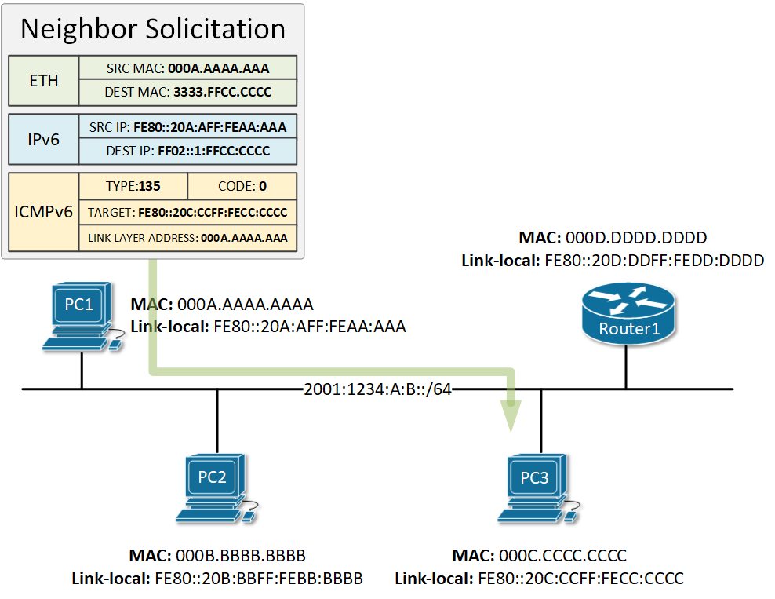

OSI 3 - Síťová vrstva - IPv6, maska, podsíťování, porovnání s IPv4, fragmentace
===

Přehled
---

Nebojte se IPv6! Je to ízi jak zmrd, jenom to jsou dlouhé adresy a pár jiných protokolů. Funguje to basically stejně jako IPv4, takže tahle otázka je úplně stejně v jednodchá.

Povídání
---

Začneme porovnáním IPv6 s IPv4. Proč vůbec vzniklo IPv6? Společnosti, které vytváří standarty se nudily a nutně nám potřebovali udělat život složitější? Vůbec a dokonce nám tím život zjednodušily. Už jsme si pověděli, že IPv4 adres je prostě málo, a proto musíme zavádět koncepty jako privátní IP adresy a NAT. To nám ale nevydrží napořád. Chytré hlavy se proto rozhodly, že potřebujeme nový standart, který bude mít delší adresy, ideálně tak dlouhé, aby ještě hodně dlouho nedošly.          
No, a přesně to se stalo, dnes máme IPv6. Nicméně spousta kritických systémů stále nepodporuje IPv6, proto je transice tak pomalá. Jak jsme se naučili od jednoho velmi milého (výjimečně neironicky, pan Ježil byl 10/10 kantor) učitele, **2^n je HODNĚ**. IPv6 adresy mají rozsah 2^128. Kdyby někdo nevěděl, to je fakt kurevsky hodně. To už jen tak nedojde. Je to dokonce tak moc, že internetový poskytovatelé se neobtěžují s rozdáváním jednotlivých IP adres a rovnou vám dají rozsah /64. To je mimochodem stále mnohem více, než je IPv4 adres celkově. Kam se poděla IPv5? Zůstala kdesi v laborce, není pro nás tedy podstatná.           
Ačkoliv jsem to mohl zmínit dříve, zmíním to alespoň teď, není to tak podstatné. Kdo vlastně kontroluje přidělení IP adres? Stará se o to nadnárodní organizace IANA. Adresový prostor je rozdělen do několika sektorů podle zeměpisné oblasti. O každý sektor se pak stará spešl organizace v dané oblasti.        
Takže, jak vlastně vypadá IPv6 adresa. Nu, značně odlišně od naší staré dobré IPv4 adresy, která se zapisuje v tečkovaném desítkovém formátu. Má 128 bitů, to je o 96 bitů víc, než má IPv4 adresa. Jak jsem již říkal, prostě shitload adres. Nikomu by se určitě nechtělo to psát po 8 bitových segmentech, museli bychom jich mít 16 a vypadalo by to jak hovno. Pro ilustraci: *12.32.123.111.211.24.1.33.12.5.224.250.0.0.1.1*. Hnusný co? Právě proto se zavedl nový způsob zápisu a to ve formátu hexadecimálním po dvou bytech v jednom "poli". Na obrázku je vidět, jak takový zápis vypadá. Připadá vám strašidelný? Nemusí, je to mega ízi, prostě je to jenom jinak zapsaný. Pokud vám šestáctková soustava nedělá problém, na tento zápis si zvyknete rychle, dokonce existují i způsoby, jak ho zkrátit. Pokud vám šestáctková soustava dělá problém, vraťte se prosím do prvního ročníku, děkuji.                

Podíváme se teď na možnosti, jak zkrátit zápis této adresy. Jsou dvě. První je, že pokud máme v nějakém poli třeba takovéto číslo: *0f1d*, můžeme nulu před ním vynechat a zapsat ho prostě jako *f1d*. Takto můžeme vynechávat pouze nuly před číslem, nikoliv za ním! Druhým zjednodušením zápisu je vynechání těch částí adresy, kde jsou samé nuly. Je to vidět na obrázku dole. Důležité je připomenout, že tuto zkratku můžeme udělat v adrese jen jednou. Proč? Jednoduše proto, že pokud bychom ji udělali vícekrát, už bychom nemohli rozpoznat, jak vypadá opravdová adresa.

Jak vypadá podsíťování? No, zatím jsem skoro neviděl jeho využití. Dole na obrázku můžete vidět takové základní rozdělení IPv6 adresy. Typicky budete pracovat s rozsahem /64 a podsíťování nebude nutně extra potřeba. Pokud ano, máte spoustu prostoru a funguje to úplně stejně jako v případě IPv4. Adresa je opět rozdělena do části síťové a uživatelské. Zde na obrázku je *Interface* ID uživatelská část. *Network ID* a *Subnet ID* tvoří síťovou část adresy.

Tak teď se dostaneme k tomu, jak IPv6 adresy vlastně fungují a především na jejich typy. Pozorně se podívejte na obrázek dole, jsou tam vypsané jednotlivé typy a jejich bloky. K maturitě stačí znát blok global unicast adres a link-local adres.

Mezi šestkami a čtyřkami je jeden velký rozdíl. Šestky nepotřebují NAT. Každá adresa v rozsahu 2000::/3 je globálně routovatelná, nebo by alespoň být měla. Tyto adresy jsou tzv. global unicast. Pokud byste ji ale chtěli použít, je potřeba si od poskytovatele koupit statický rozsah, typicky bývá levnější než jedna IPv4 adresa. Dostaneme síťovou část adresa a 2^64 uživatelských adres, se kterými si můžete hrát.            
Dalším důležitým typem IPv6 adresy je tzv. link-local. To jsou adresy z bloku FE80::/10, nicméně standart definuje, že dalších 54 bitů, tedy zbytek síťové části adresy, musí být 0. Tyto adresy musí být pouze lokálně unikátní, nejsou routovatelné, jsou v podstatě takovým ekvivalentem privátním IPv4 adres.                  
*Teď jen takové malé vědomostní okénko. IPv4 má také link-local adresy, konkrétně z rozsahu 169.254.0.0/16. Z tohoto rozsahu si počítač automaticky nastaví nějakou adresu, nenajde-li na síti DHCP server, nebo pokud mu sami nenastavíte jinou. V životě jsem se jimi nemusel zabývat, ale je dobré vědět, že existují. Nicméně teď když víme, že existují i tyto adresy, IPv6 link-local adresy mají nejblíže právě k tomuto bloku z rodiny IPv4 adres.*         
Kde tyto adresy ale váš počítač vezme? Nu, link-local adresu si zkrátka vygeneruje, resp. její uživatelskou část, protože síťovou má danou. K tomuto generování se využívá jeden ze dvou způsobů. Jedním z nich je starý dobrý random bullshit gou. Uživatelská část se zkrátka vygeneruje náhodně. Ačkoliv šestkových adres je tolik, že je skoro nemožné, aby se náhodně vygenerovala stejná adresa u dvou zařízení na síti, provádí se kontrole duplicity pomocí DAD (Duplicate Adress Detection). O tom si povíme v otázce o DHCP. Pro ilustraci, udělal jsem si jednoduchý výpočet takové pravděpodobnosti a kdybychom měli např. síť s 2048 zařízeními, pravděpodobonost, že 2049 zařízení bude mít stejnou adresu jako některé z nich, je plus minus *1.110223e^-16*.        
Druhým způsobem generování uživatelské části adresy je proces EUI-64. Využívá k tomu MAC adresu zařízení, což potencionálně může být bezpečností riziko. Dole na obrázku je popsaný velmi pěkně. Prostě se doprostřed MAC adresy vloží *FFFE* a následně je flipne sedmý bit. Proč to takhle je? Joooo, gut kveš, nemám páru a nemám ani potřebu to dohledávat. V dnešní době se již více začíná využívat generování náhodné.       
Uživatelská část se generuje stejným způsobem i v případě global unicast adresy. Může ale být i přidělena DHCP serverem. Také je potřeba zjisti, jakou síťovou část má vlastně využít. To ale vše až v otázce o DHCP.

Dobře, jdeme se podívat na zbytek typů IPv6 adres. Vůbec se nenechte zastrašit jejich počtem, většinu již buď znáte ze čtyřek, nebo je nebudete nikdy potřebovat.       
Adresa může být nespecifikovaná *::/128*. Existují loopack adresy, mají tento rozsah *::1/128*. Fungují naprosto analogicky k těm z IPv4. Tzv. ULA (Unique Local Address) je adresa, která není globálně routovatelná, ale lze ji použít v domácím nebo firemním prostředí. Takže v podstatě privátní IPv4 adresa. Rozsah máte zapsaný na jednom z obrázků výše. Existují také multicast adresy, opět fungují stejně jako u čtyřek.     
Co je ale rozdílem oproti čtyřkám, je absence broadcast adres. Šestky zase mají něco, čemu se říká anycast. To je typicky adresa z bloku GUAs, je ale nastavena na více zařízeních, která tek budou patřit do jedné skupiny. Pokud vyšleme dotaz na tuto adresu, odpoví vždy zařízení, které je nám nejblíže. Je potřeba na zařízení, na kterém anycast adresu nastavujeme, explicitně říct, že adresa je anycast.                
Podíváme se teď, jak vypadá IPv6 header. Ten se od našeho čtyřkového značně změnil, jak lze vidět dole na obrázku. Spousta polí byla odstraněna, pár změnila jméno, jedno dokonce přibylo. Nebojte, vše si vystvětlíme.

**Version** obsahuje vždy hodnotu 0110, tedy 6.     
**Traffic Class** je využíván pro QoS. Žádná z otázek QoS nezmiňuje, takže se jím nebudeme zabývat.         
**Flow Label** se zabývá jakýmisy toky paketů. Pokud to někoho zajímá, můžete si to dohledat, mi to zde nebudeme řešit.         
**Payload Length** v sobě má uloženou velikost payloadu, tedy L4 segmentu uloženého v paketu.           
**Next Header** indikuje, jaký protokol je uzavřený v payloadu, třeba TCP. Funguje analogicky k poli *Protocol* z IPv4 headeru.         
**Hop Limit** je pouze přejmenovaný *TTL*.      
**Source a Destination Address** si snad vysvětlovat nemusíme. Nicméně zde musí mít obě pole samozřejmě 128 bitů, protože máme větší adresy.        
Ukážeme si teď, jak funguje ARP v případě IPv6. IPv6 totiž využívá služeb ICMPv6 k dosáhnutí stejných výsledků, jako v případě ARPu u IPv4.

Na obrázku výše můžete vidět, jak může takový paket vypadat. Otázka Nighbor Discovery Protocol (NDP) nezmiňuje, takže ho nebudeme probírat doprodrona. Nicméně je to neoddělitelná část IPv6, takže si ji alespoň zmíníme.      
NDP je takový velmi handy dandy protokůlek, který nám umožňuje především dvě věci. Dokáže napodobit funkci ARPu a dovede nalézt aktivní směrovače na síti. Využívá ICMPv6, což je protokol pro různé internetové zprávy.        
NDP *Neighbor Solitication* message funguje analogicky k ARP requestu. Abyste si to lépe pamatovali, solicitation znamená žádost, takže počítač o něco žádá. Jak tento paket vypadá, vidíte na obrázku výše. Využívá již 3 síťové vrstvy, takže IP adresa nemusí být uložena přímo v protokolu. Také nevyužívá broadcast, anžto IPv6 broadcast ani neumí. Používají se tzv. solicited node multicast adresy. Ty vznikají speciálním způsobem, který si nebudeme objasňovat. Můžete je chápat stejně jako klasické multicast adresy, dorazí prostě jen pár vyvoleným zařízením.     
Také se zde objevuje multicast MAC, o kterém si také povídat nebudeme. Druhý počítač tedy paket přijme a vyšle *Neighbor advertisement*. Ten už vyšle přímo zařízení, ze kterého mu přišlo NS, zprávu, která obsahuje jeho MAC adresu.          
Dalšími zprávami jsou tedy *Router Solicitation*, *Router Advertisement*. Ty se využívají k nalezení směrovače na síti. Najdou své využití v DHCPv6

Výše je takový ilustrační obrázek. Podíváme se trochu více do hloubky na to, proč a jak vypadá fragmentace paketu, abychom pochopili, jak funguje u IPv6.           
Určitě jste již někde viděli napsanou zkratku MTU (Maximum Transmission Unit). Tu udává druhá vrstva a prostě a jednoduše říká, jaká maximální velikost rámce může být přenesena přes dané médium. Typicky to bývá 1500 bytů. Nicméně to nemusí vždy platit, může být i menší. IPv4 má v headeru zabudované pole, které slouží přesně k řešení těchto problémů. Pokud na router přijde paket, který je moc velký, aby mohl vystoupit portem, kterým má být poslán, router tento paket fragmentuje na více částí. Každý takto fragmentovaný paket má stejné identifikační číslo, číslo své pozice v řetězci paketů a flag, zda po něm následuje další fragment, či nikoliv.              
Jak jste si ale určitě všimly, IPv6 nemá ve svém headeru žádné mechanismy, které by řešily fragmentaci. IPv6 tento problém totiž řeší jinak. Fragmentaci nedeleguje na směrovače, ale nutí zařízení, ať si své pakety fragmetuje samo. Každé zařízení tak musí své pakety fragmentovat inteligentně a optimálně. Pokud přijde na směrovač paket, který je pro port moc velký, prostě ho zahodí a vyšle ICMPv6 zprávu zařízení o tom, že paket byl moc velký. Fragmentace probíhá pomocí jakéhosi přídavného headeru. Pokud to někoho zajímá, může si to vyhledat.

Materiály
---

Jeremy's IT Lab - IPv6 Part 1 - https://www.youtube.com/watch?v=ZNuXyOXae5U     
Jeremy's IT Lab - IPv6 Part 2 - https://www.youtube.com/watch?v=BrTMMOXFhDU          
Jeremy's IT Lab - IPv6 Part 3 - https://www.youtube.com/watch?v=rwkHfsWQwy8         
IPv6 Reference Card - https://www.ripe.net/media/documents/ipv6_reference_card.pdf      
Cisco - Anycast - https://www.cisco.com/c/en/us/td/docs/ios-xml/ios/ipv6_basic/configuration/xe-3s/ip6b-xe-3s-book/ip6-anycast-add-xe.pdf               
Chris Greer - How IP Fragmentation Works - https://www.youtube.com/watch?v=vdajb14Lcu0