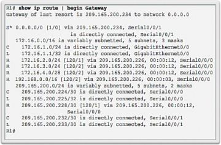
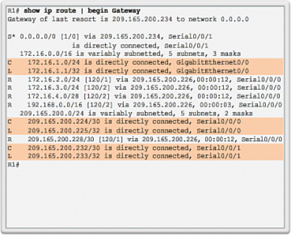
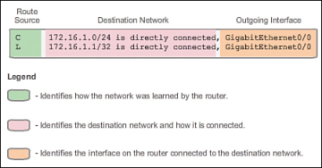
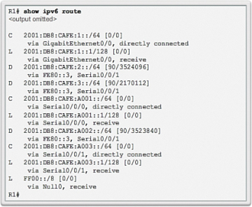
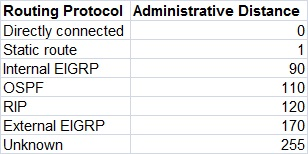
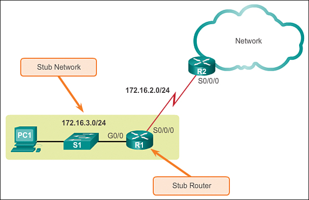

OSI 3 - Síťová vrstva - Statické směrování, tabulky, statické vs. dynamické směrování, administrativní vzdálenost
===

Přehled
---
Supr otázka, směrování není složitý koncept. Zde dokonce nemusíte vyprávět ani o protokolech pro dynamické směrování.

Povídání
---
V předchozích otázkách jsme si říkali, že routery rozhodují, kam pakety pošlou. Jak to vlastně dělají? Využívají něco, čemu se říká směrovací tabulka. Ve směrovací tabulce je zapsáno, kam (na jakou síť, nebo kterým portem) se má paket poslat na základě jeho cílové IP adresy. Pokud se ve směrovací tabulce nenajde záznam, do kterého by spadala cílová IP adresa, paket je zahozen.     

Dobře, to bychom měli suchou teorii, teď trochu polopatě. Směrovač sám o sobě neví, kam má paket poslat. Resp. zná jenom sítě, které využívají jeho porty. Pro tyto sítě je v routovací tabulce automaticky vytvořen záznam označený písmenem C (connected). Takže jakmile přiřadíme nějakému portu IP adresu, je ve směrovací tabulce vytvořen záznam pro tuto síť. S tohoto důvodu nepotřebujete konfigurovat routing, pokud mezi sítěmi využíváte pouze jeden router. Co znamená to L, ptáte se? Že to vypadá jako úplně stejný záznam? Ne tak úplně, podívejte se pořádně. Správně, má masku */32*. Co to znamená? To je zkrátka a dobře IP adresa portu, ke kterému je připojena daná síť.

Ještě předtím, než se posuneme na další typy routů, si vysvětlíme, jak se orientovat ve směrovací tabulce. Na Cisco zařízeních je vždy první nějaké písmeno velké obecedy. To říká, jakým způsoběm se router záznam naučil. *C* a *L* je pro přímo připojené sítě, *S* je pro statický route, *R* je pro protokol RIP, *O* pro OSPF atd.          
Následuje IP adresa sítě, na kterou chceme směrovat. Pokud má tedy paket v poli *Destination IP* IP adresa z této sítě, využije pro něj router tento záznam.        
Poslední může být jedna z několika věcí. Můžeme zde najít IP adresu zařízení, na které má router paket poslat dále, typicky nějaký sousední router. Druhou možností je port, kterým má router paket poslat. Zde ale pozor, tento způsob funguje pouze v případě, je-li spojení mezi tímto a dalším zařízením na tomto portu point-to-point. Poslední možností je tzv. fully specfied route. Je tam tedy jak IP adresa sítě, tak port.  

Dalším typem routu je tzv. defaultní route. Směrovač využije tento route, pokud nenajde ve směrovací tabulce žádný specifičtější. Málem bych zapomněl zmínit, router vždy vybere ten nejspecifičtější route, tedy route, který nejblíže odpovídá IP adrese v paketu. Abyste si to dokázali představit, defaultní route vypadá takto:  *0.0.0.0/0*. Na Cico zařízeních má identifikátor ve tvaru S*.       
Ještě, než se dostanem k administrativní metrice a floating routům, podíváme se, jak by stejné věci vypadaly v IPv6. Toho se nemusíte vůbec bát, vypadaly by totiž v podstatě stejně. Třeba defaultní route v IPv6 se zapisoje takto: *::/0*. Jediným zásadním rozdílem je, že můžete použít i Link Local adresy, nicméně pouze v případě fully specified routu.

Administrativní vzdálenost (AD) je číslo, které označuje, jakou prioritu má daný route. Dole můžete vidět tabulku. Priorta je tedy nastavena na základě toho, jak route vznikl. Implementujeme ji, aby nevznikaly při implementaci více protokolů smyčky.     

Konceptu AD se využívá při vytváření tzv. floating routů. AD se totiž při vytvoření routu dá specifikovat. Pokud úmyslně specifikujeme hodnotu AD u routu tak, že po vypadnutí jiného routu ho právě tento nahradí, říkáme mu floating route. Třeba pokud máme route, který se směrovač naučil pomocí protokolu RIP, bude mít AD 120. Vytvoříme tedy statický route s AD 121, který ihned zastoupí ten původní v případě problému.      
Tak a teď si konečně ukážeme, jak takový route vytvořit. Můžeme vytvářet pouze tzv. statické routy. Statické jsou prostě protože jsme je vytvořili my a nijak se nemění, dokud je nezměníme právě my. Jejich vytvoření je banální, zkrátka specifikujeme síť, na kterou chceme routovat a pak IP adresu next hopu, port, nebo obojí. Můžeme routu také nastavit AD.     
K čemu jsou statické routy dobré, když si je musíme spravovat sami? Nu, jsou dobré právě v tom, že si je spravujeme sami. Jsou tak bezpečnější a jejich existence na síti nezpůsobuje žádné zpomalení. Nejčastěji se používají třeba u tzv. stub networků. To je síť, ke které už jsou připojena pouze koncová zařízení, obsahuje typicky jeden router, který vše posílá jedním směrem. Zde je naprosto zbytečné implementovat nějaký dynamický routovací protokol, takže se zde zkrátka nastaví statický route.        
Nicméně statické routy jsou zároveň na nic v tom, že pokud se topologie sítě změní, nebo linka vypadne, statický route se neumí přizpůsobit a můsíme ho odstranit nebo upravit sami. Ve větších sítíc tedy na pomoc přicházejí dynamické routovací protokoly, třeba OSPF. Ty se změně topologie a výpadkům plně přizpůsobují. Nicméně přidávají do sítě spoustu komunikace mezi routery, ta může síť zpomalovat.

Materiály
---
Jeremy's IT Lab - Routing fundamentals - https://www.youtube.com/watch?v=aHwAm8GYbn8        
Jeremy's IT Lab - Static Routing - https://www.youtube.com/watch?v=YCv4-_sMvYE      
Cisco Press - Static Routing - https://www.ciscopress.com/articles/article.asp?p=2180209&seqNum=4
