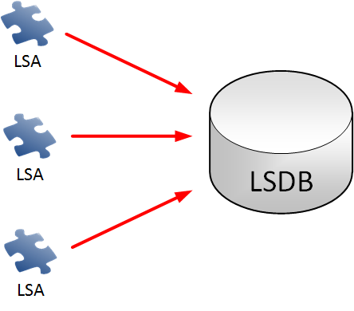
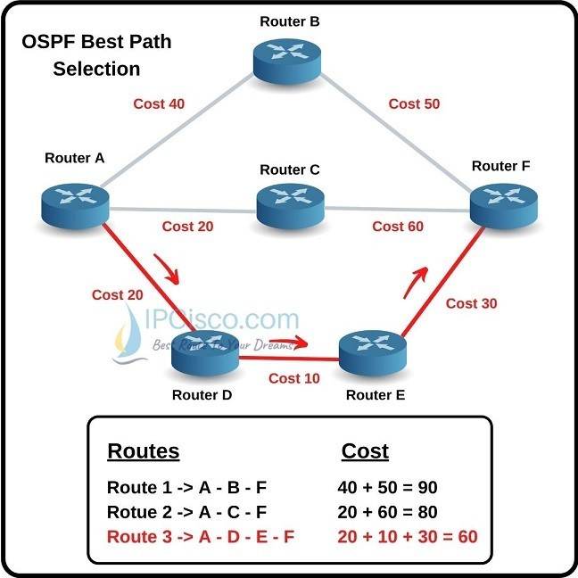
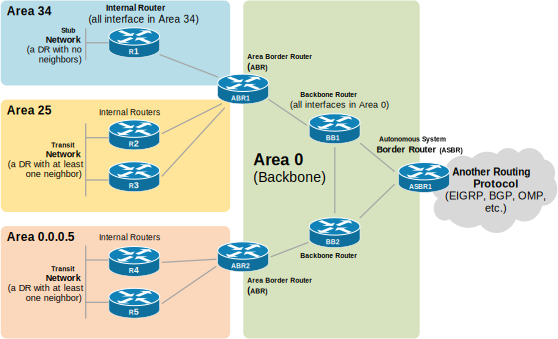

OSI 3 - Síťová vrstva - Dynamické směrování (RIP, OSPF), konfigurace, metriky, administrativní vzdálenost
===

Přehled
---
Docela pěkná otázka, když si dáte trochu práce a naučíte se řádně fungování OSPF, tak vám rozhodně nedojdou témata. Administrativní vzdálenost jsme si vysvětlili v předchozí otázce, nebudu ji zde opakovat.

Povídání
---
Dynamické směrování. Bylo navrženo pro velké sítě, kde by mohlo být složité udržovat statické routy. Na směrovačích v této síti se spustí jeden z protokolů (RIP, OSPF, EIGRP, případně BGP), nastaví se, na jakých sítích nebo portech mají fungovat, a směrovací tabulky se pak vytvoří dynamicky. Tento přístup má především jednu zásadní nevýhodu. Síť se tak zpomalí, protože směrovače musí odbavovat ještě tento protokol. Typicky mezi sebou směrovače s takovým protokolem zapnutým komunikují a tím vytvaří na sítí další traffic.       
K vybrání těch nejlepších cest využívají různé protokoly různé metriky. Nejjednodušší metriku využívá RIP, který při každém skoku přičte hodnotu 1, takže bere v potaz pouze počet skoků. OSPF už bere v potaz i rychlost jednotlivých propojení. Metrika je tedy jakési kritérium, podle kterého se prokol rozhoduje, jaký route vybrat, má-li jich na výběr více. Jako metriku označujeme číslo, které tímto procesem vzniklo.       
Ještě předtím, než se podíváme, jak funguje OSPF, si povíme, kde se který protokol nejčastěji používá, ať máte nějakou představu. RIP je nejstarší z nich, je neefektivní, zato jde velmi jednoduše nastavit, někdy se pro svou jednoduchost využívá v laboratorních podmínkách. OSPF a EIGRP se využívají běžně. Hlavním rozdílem je, že EIGRP je Cisco priprietary a OSPF je volně dostupný protokol. Proto si budeme říkat, jak funguje právě OSPF. Zajímavým protokolem z této rodiny je BGP. S tímto protokolem se spíš nesetkáte, přesto hraje klíčovou roli ve fungování internetu. Routuje velké bloku IP adres v nejvyšších vrstvách internetu mezi předními firmami na tomto poli. Problematika BGP je mnohem rozsáhlejší, ale my se jím tu nemusíme zabývat, otázka ho přímo nezmiňuje. Existují i různé typy těchto protokolů podle toho, jak mezi sebou komunikují a vytváří svou routovací tabulku. Pokud vás to zajímá, je to zmíněné ve videích v materiálech, já se o tom bavit nebudu.          

Tak, teď se již můžeme podívat na OSPF (Open Shortest Path First). Představení fungování tohoto protokolu nám dá jakýsi vhled do fungování ostatních protokolů tohoto typu. Existují tři verze OSPF. Nás bude zajímat verze 2. Verze 1 je zastaralá a verze 3 byla vytvořena především pro IPv6. OSPF je postavené na tom, že každý směrovač má STEJNOU a ÚPLNOU mapu celé sítě. Routery si mezi sebou posílají LSA (Link State Adverisement) a pomocí nich si vytváří LSDB (Link State Database). Směrovače rozesílají LSA, dokud si všechny nevytvoří stejnou LSDB.

Proces OSPF tedy vypadá nějak takto. Nejdříve musíme na routerech, které chceme v síti využít nastavit OSPF. To lze nastavit na základě sítí, nebo per interface. Takto nastavené směrovače si mezi sebou začnou zasílat LSA, dokud nevytvoří jednotné LSDB. Pak si každý z nich jednotlivě spočítá nejlepší cesty k jednotlivým bodům LSDB.        

Dalším důležitým konceptem v OSPF je tzv. OSPF area. Pokud máme síť je no několika málo směrovačích, je naprosto v pořádku fungovat pouze na jedné aree. Nicméně s přibývajícím počtem routerů může tento přístup mít značné nevýhody. Každá změna v síti musí být propagováná všem routerům, kterých je opravdu hodně, a každý musí v paměti udržovat velkou LSDB. OSPF tento problém řeší pomocí OSPF areas. 

K maturitě vám bohatě stačí znát konfigurace single-area OSPF, nicméně je dobré si zmínit, že existuje i multi-area a využívá se. Speciální roli má area 0. Říká se jí Backbone a právě na této vrstvě sítě se využívá, tedy někde v páteři. My ji spíš známe s konfigurace single-area OSPF jako jedinou areu, kterou jsme kdy použili.            
OSPF area je tedy nějaký set směrovačů, kteří sdílí stejnou LSDB. Všechny musí být nějak spojené s areou 0, která je páteřní. Routery v areích jsou rozděleny do dvou typů, interní a hraniční. Hraniční router si ukládá separátní LSDB pro každou areu, která je k němu napojena. Doporučuje se napojovat na hraniční router maximálně dvě.           
Povíme si ještě něco k metrice, kterou OSPF využívá. Nazývá se také cost, tedy cena cesty. Jak jsem si již řekli, roli hrají především dvě věci, rychlost spojení a implicitně také tedy počet spojení mezi směrovači. Využívá se referenčního bandwidthu, který je defaultně nastaven na 100mbps. Spojení s touto rychlostí je tedy přiřazena hodnota 1. Spojení s rychlostí 10mbps tedy má cena 10. Co se děje s rychlejšími spojeními? Všechny mají také cenu 1. Tuto referenční hodnotu lze samozřejmě přenastavit.             
Jak routery zjistí, že mají souseda? Jednoduše, OSPF vysílá hello pakety, které to dají vědět. Podle toho, jesli směrovač stále vysílá hello pakety, nebo ne, se také určuje, zda je potřeba síť překalkulovat, či ne.          
Poslední věc k OSPF, kterou si zmíníme, je tzv. DR a BDR, tedy Designated Router a Backup Designated Router. Ty jsou potřeba, běží-li síť třeba po ethernetu a na sítí je tak více zařízení připojených třeba k jednomu switchy. Aby nově připojení router nedostal osmkrát tu samou databázi, zavádí si DR. Směrovače si nejdříve zvolí svého DR.

Materiály
---
Jeremy's IT Lab - Dynamic Routing - https://inv.nadeko.net/watch?v=xSTgb8JLkvs             
Jeremy's IT Lab - RIP & EIGRP - https://inv.nadeko.net/watch?v=N8PiZDld6Zc          
Jeremy's IT Lab - OSPF Part 1 - https://inv.nadeko.net/watch?v=pvuaoJ9YzoI          
Jeremy's IT Lab - OSPF Part 2 - https://inv.nadeko.net/watch?v=VtzfTA21ht0              
Jeremy's IT Lab - OSPF Part 3 - https://inv.nadeko.net/watch?v=3ew26ujkiDI
packetpushers.net - OSPF - https://packetpushers.net/blog/ospf-graphs-lsas-and-the-lsdb/