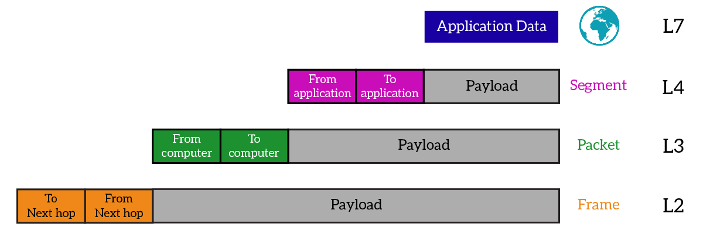
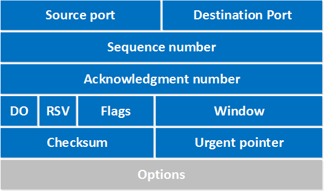
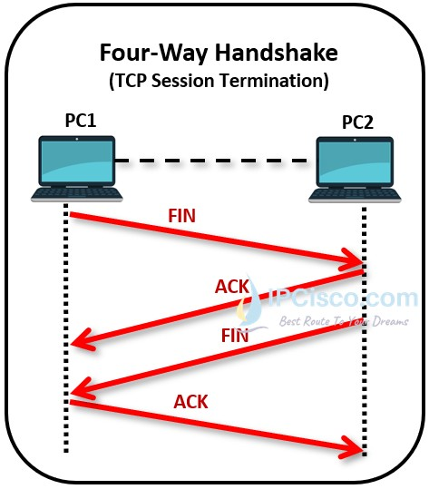
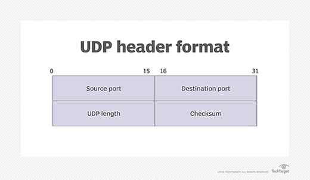

OSI 4 - Transportní vrstva - UDP, TCP, segmentace a znovusestavení, řízení přenosové rychlosti, kontrola chyb
===

Přehled
---

Tato otázka dovede být záludná, ale jakmile pochopítá TCP a UDP, půjde to v klidu.

Povíání
---

Povíme si konečně něco o tom proslulém TCP a UDP. Nachází se v transportní vrstvě síťového modelu. Jsou tedy zapečetěni v IP headeru. Přidávají do našich sítí další důležitou věc, porty. PDU (Protocol Data Unit) je zde segment, to jsou data s headerem transportního protokolu.     

Jak vlastně fungují porty? Destination Port vždy identifikuje aplikaci, ke které se připojujeme. Source Port je většinou vybrán náhodně. Takto můžeme mít v jednu chvíli hned několik konekcí najednou.             
IANA (Internet Assigned Numbers Authority) rozdělila porty do třech kategorií. *0-1023* jsou tzv. well-known porty. Na těchto portech najdete valnou většinou klíčových protokolů internetu, DNS, FTP, DHCP, SMTP, IMAP, SSH, ... Jejich přiřazování je pečlivě kontrolováno. Druhou katerogiríí jsou registrované porty v rozsahu *1024-49151*. Ty už nejsou tak striktně hlídané. Nejdete zde např. různé databázové porty, TOR, všemožné aplikace využívají tyto porty. Poslední kategorií jsou privatní nebo dynamické porty, *49152-65535*. Z tohoto rozsahu počítač vybírá source porty pro spojení.      
Na 4 vrstvě pracují především dva protokoly, TCP a UDP. O jiném protokolu jen zřídka uslyšíte. Podíváme se na tyto dva protokoly a vysvětlíme si jejich funkci.         
Pozn.: Určitě jste již slyšelo pojem "soket". V síťování tento pojem označuje kombinaci *IP adresa - Port*. Zapisuje se nejčastěji takto: *192.168.0.10:8080*. To znamená port *80* na adrese *192.168.0.10*.        
TCP (Transmission Control Protocol) přinásší hned několik klíčových funkcí. Protokol IP je tzv. best-effort. To znamená, že se nestará o to, zda paket dorazil na místo, kam měl, a zda tam dorazil bez chyby. Nesnaží se pakety poslat znovu, pokud nastane nějaká chyba. To však může být v některých případech nežádoucí. Proto máme TCP.        
TCP je **connection-oriented**. Předtím, než může začít komunikace, musí TCP vytvořit aktivní spojení se zařízením. To je zařízení pomocí three-way handshaku. Spojení je pak ukončení four-way handshakem. Abychom tyto mechanismy mohli správně pohopit, musíme se podívat do TCP headeru, to uděláme záhy.           
TCP poskytuje **spolehlivou komunikaci**. Každý segment, který uživatel při TCP spojení obdrží, musí potvrdit. Resp. musí potvrdit jeho přijetí. Pokud tak neučiní, zařízení, které segment odeslalo, ho odešle znovu.              
TCP se stará o **správné pořadí dat**. Segmenty tedy mají nějaké pořadové číslo a pokud náhodou přijdou neseřazeny, TCP se postará o jejich seřazení i o případné nedoručení některých segmentů v řadě.             
Poslední klíčovou věcí, kterou TCP zařizuje, je **flow control**. Co tím myslím? TCP dovede dynamicky zvyšovat a snižovat objem dat, který zasílá, pomocí konceptu TCP sliding window. Potvrzovat přijetí každého segmentu by bylo velmi drahé a zbytečné. Potvrzuje se tedy typicky blok segmentů. TCP tedy nejdříve začne navyšovat počet segment před dalším potvrzením. Jakmile jeden nebo více segmentů nedorazí, TCP přizpůsobí počet zasílaných segmentů. Během komunikace se může počet zaslaných segmentů před dalším potvrzením dynamicky měnit.

TCP header si rozebereme jen velmi stručně, ani k CCNA není potřeba ho znát celý, takže určitě ani u maturity ho po vás nikdo chtít nebude. Jestli jo, tak flusněte Masopustovi mezi oči, třeba si to rozmyslí.          
Velmi důležitými poli jsou samozřejmě **Source port** a **Destination port**. O těchto polích jsme již hovořili.        
**Sequence number** a **Acknowledgement number** se starají pořadí dat a jejich doručení.           
Pole **Flags** obsahuje několik vlaječek. Nás budou zajímat jen tři z nich, které se používají k zahájení a ukončení TCP komunikace. **SYN**, **ACK** a **FIN**.        
**Window** nám poskytuje zmíněný flow control pomocí TCP klouzajícího okna.     

Na obrázku výše vidíte TCP Three-Way Handshake. Dobře si ho zapamatujte. SYN, SYN-ACK, ACK. Je začátkem každé TCP komunikace. Využívá zmíněných vlaječek. Nejdříve tedy přijde segment, který má setlou vlaječku SYN, následně segment s vlaječkami SYN a ACK a naposled segment s vlaječkou ACK.

Tentokrát je na obrázku výše TCP Four-Way Handshake. Ukončuje komunikaci. Opět doporučuji si ho zapamatovat. FIN, ACK, FIN, ACK.            
Podíváme se teď na druhý hojně využívaný protokol, UDP (User Datagram Protocol).     

Výše vidíte, jak vypadá UDP header. Je značně jednodušší než TCP header. A to naprosto záměrně.         
UDP neposkytuje většinu služeb, které poskytuje TCP. Nesrovnává segmenty, při chybě je neposílá znovu, nevytváří spojení, nedělá flow control. V podstatě jen poskytuje port, na který lze data zaslat.         
UDP segment se nazývá datagram, budu ho odteď tak nazývat.          
UDP je, stejně jako IP, best-effort. Druhému zařízení tedy prostě posílá data, o nic jiného se nestará.         
Dobře, cool, ale k čemu mi teda je? Dobrá otázka, vysvětlíme si teď, k čemu se jednotlivé protokoly využívají. TCP nachází své využití např. na webu, při dálkových spojeních, odesílání a stahování souborů, různých kontrolních kanálů, email. Zkrátka všude, kde je naprosto nezbytné, aby dorazila všechna data ve správném pořadí a bez chyb a jste za to ochotni obětovat trocha výkonu.          
Kde je ale TCP naprosto nevyužitelné, mohou být například videa, hovory přes IP, DHCP, ... Určitě byste nechtěli, aby se vám video stoplo pokaždé, když TCP nedoručilo paket a musí se poslat znovu. Stejně tak byste čekat u hovoru. Ale když náhodou něco přijde, něco neuslyšíte nebo tomu nebudete rozumět, prostě to řeknete znovu. U živého vysílání je UDP také nezbytné, protože ani není prostor pro znovuzaslání dat.       

Materiály
---
Jeremy's IT Lab - TCP and UDP - https://inv.nadeko.net/watch?v=LIEACBqlntY
