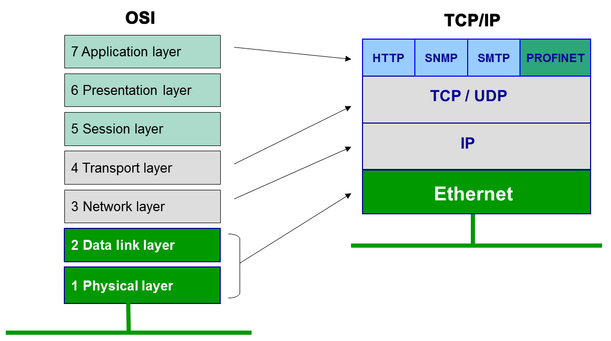
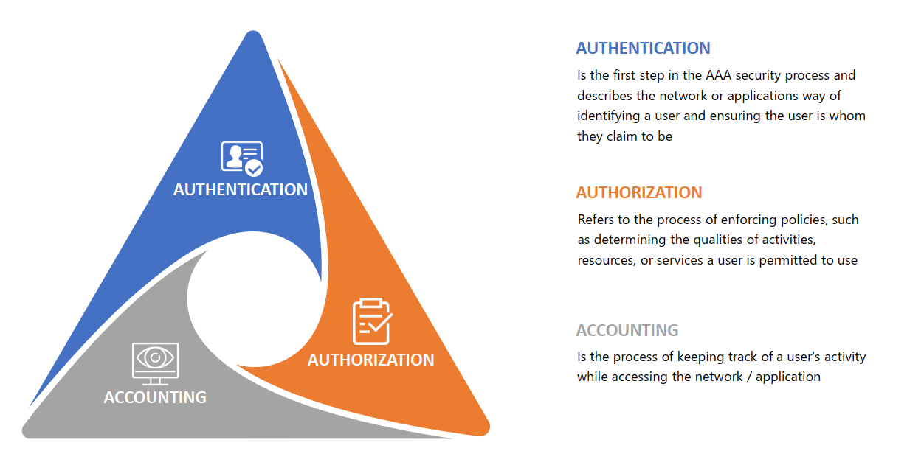
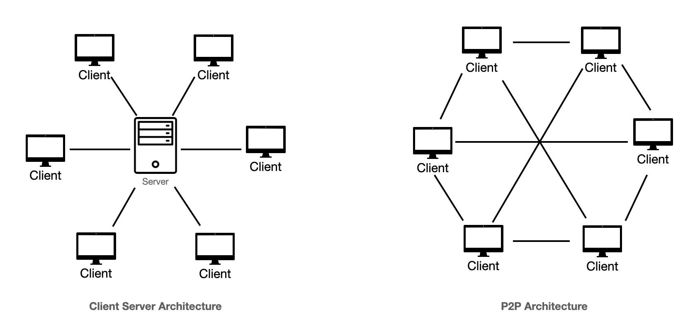

OSI 5, 6, 7 - soketové programování, převod formátů dat, šifrování, komprese, autentizace
===

Přehled
---

Zadání této otázky může být trochu zavádějící. Když se ale chytnete toho, že jste na síťové úrovni 5-7, jde z toho něco uvařit. Hlavní je zmínit všechny body, my si je tu také všechny vysvětlíme.     

Povídání
---
Konečně se dostáváme k aplikační vrstvě. Resp. ke třem vrstvám OSI modelu. Nicméně 5 vrstva, session layer, a 6 vrstva, presentation layer, se zmiňuje spíše zřídka. V TCP/IP modelu jsou také pod aplikační vrstvou. Je ale důležité znát jejich místo v síťovém stacku.       
L5 je stará o session multiplexing a demultiplexing spojení. L6 se stará o formát dat, kompresi a šifrování. Funkce těchto tří vrstev se prolínají a silně spolupracují, proto si je můžeme představit zkrátka jako jednu velkou vrstvu.

Podíváme se společně na protokoly, které na této vrstvě pracují, některé si v dalších otázkách rozebereme více do podrobna, ostatní si alespoň zmíníme. Vysvětlíme si základní principy komprese a ukážeme si i funkci authentizace v síti. Šifrování je tu sice také zmíněno, my si do něj ale uděláme jen takový úvod, protože právě na šifrování je zde speciální otázka.        
Funkce aplikační vrstvy nejlépe pochopíme podle protokolů, které zde operují. Asi nejznámějším z nich může být HTTP (Hyper Text Transfer Protocol). Využívá se na webu. Nepotřebujeme vědět, jak funguje, to necháme lidem, kteří marutují z webovek, nicméně hrubý popis funkce takového protokolu nám poslouží dobře. Určitě je potřeba data, které tento protokol přepravuje, dát do takového formátu, kterému bude rozumět i soket, který data přijme. Takový formát samozřejmě mohou být samotné byty, které jsou na druhé straně přeloženy do písmen a znaků, nicméně takový postup není zrovna efektivní .. samozřejmě na kabelu opravdu putují pouze bity, ale datům uloženým ve zprávě dáme nějaký tvar, hned nám to usnadňuje práci. Mohou tedy třeba obsahovat také nějakou hlavičku.            
Další problém, který vrstvy níže neřeší, je velikost dat. Je rozhodně velmi neefektivní přenášet data ve formátu, ve kterém byla zformátována. Proč? Prostě protože když zapojíme kompresi dat, které rozumí i cílové zařízení, můžeme rázem přenést stejné množství dat menším množstvím zpráv.            
Komprese může být buď ztrátová, nebo bezztrátová. Ztrátová komprese odstraňuje z dat informace, které považuje za méně důležité. Příklady formátů, které tuto metodu využívají mohou být MP3, JPEG, ... Bezztrátová komprese dělá přesně to, co říká, komprimuje data bez ztráty. Typicky ji lze využít při kompresi textu, tedy částo i v síťovém provozu. Po takové komprimace je koncové zařízení schopno sestavit původní soubor přesně v takovém stavu, v jakém se nacházel před kompresí.         
Pro představu funkce bezztrátové komprese, nahrazuje například často se opakující slova a fráze nějakým znakem. Pak se pro tyto znaky vytvoří slovník. Přijmající zařízené jednoduše nahradí znaky opět frázemi ze slovníku.                 
Poslední z klíčových problémů, na které bychom řešení jen těžko hledali v nižších vrstvách, je šifrování. V dnešním světě, kde každý chce ukrást vaše data a internet je extrémně rozsáhlý, se bez šifrování neobejdete. Např. HTTP defaultně šifrované není, šifrování pro něj zprostředkovává TLS (Transport Layer Security), o kterém budeme mluvit v příslušné otázce.          
Tak, teď si uděláme takové malé okénko do bezpečnosti. Na obrázku níže můžete vidět něco, čemu se říká AAA Triangle. Je to jakýsi pilíř moderní síťové bezpečnosti. Třemi základními prvky tedy jsou **Autentizace, Autorizace a Vedení záznamů**.         

Pod vedením záznamů si určitě dokážete něco představit. Zkrátka a dobře cheme vědět, kdo a kdy něco dělal.          
Autorizace je proces, při kterém se ověřuje, zda nějaký uživatel má přístup k nějakému zdroji, může něco vykonat. Např. v Unixových operačních systémech je autorizace zajištěna třeba právech na souborech. Zde se ověřuje, zda má daný uživatel právo vykonat na souboru nějaký úkon (přečíst ho, zapsat, přesunout, smazat, ...). Tomu se říká autorizace.           
Autentikace ale vždy musí proběhnout jako první. Je to ověření identity. Kamkoliv se přihlašujete, musíte nejdřív projít autentikací.           
Otázka sice zmiňuje pouze autentikaci, nicméně spoustu způsobů, které zahrnují autentizaci, zahrnují i autorizaci a záznamování.                
Začneme u naprosté klasiky, protokolu RADIUS (Remote Authentication Dial-in User Service). Nemusíté znát, jak tento protokol funguje, nicméně RADIUS server se hojně využívá pro centralizovanou autentikaci. Místo toho, aby každé zařízení na síti mělo svou vlastní databázi uživatelů, všechny zařízení komunikují s RADIUS serverem, který jim AAA (Authentication Authorization and Accounting) zprostředkovává.          
Ačkoliv to asi nebudete potřebovat, lze využít také protokolu TACACS+.          
Pokud využíváte vidle, dost možná někdy využijete další ze známých standartů pro AAA, Kerberos. Ten poskytuje tzv. SSO (Single Sign-on). Jednou se autentizujete serveru a můžete využívat více různých zdrojů, které by normálně vyžadovaly autentizaci, bez další autentizace. Potom, co se poprvé autentizují, server jim dá šifrovaný tiket, který následně ukazují ostatním zdrojům jako důkaz, je se úspěšně ověřili.             
Dalším moderním trendem při autentizaci je multi-factor autentizace. Heslo je něco, co uživatel zná. Abychom dosáhli více faktorové autentizace, musíme přidat další .. well, faktor. Takovým faktorem může být něco, co máme. Třeba karta nebo mobil s aplikací. Něco, co jsme. Třeba otisk prstu. Existuje i více metod pro multi-factor autentizaci.         
Dobrá tedy, jaké zatím známe způsoby autentizace? Heslo, multi-factor, lze použít také pouze otisk prstu, obličeje. Ukázali jsme si také SSO. Nu, poslední metodou, která stojí za zmínku, je třeba nějaký certifikát. Např. když se přihlašujete pomocí SSH na instanci umístěnou někde na cloudu.         
Z dalších protokolů existuje ještě EAP (Extensible Authentication Protocol), který lze použít pro bezdrátovou autentizaci k RADIUS serveru.         
Problematika autentizace je velmi rozsáhlá, záměrně tu žádný z protokolů nerozebírám, bylo by to na dlouho.         

Věc, která určitě stojí za zmínku, jsou architektury client-server a P2P (Peer-to-Peer). Client-server už jistě dobře známe. Jedno zařízení funguje jako server a druhé jako klient. Server poskytuje službu, klient ji využívá. Pokud např. komunikujeme mezi dvěma zařízeními, role se mohou dynamicky v průběhu komunikace měnit.                            
P2P je trochu odlišný mechanismus. Každé zařízení je zde klient i server zároveň. Všechna zařízení jsou spolu propojena. Příkladem může být třeba torrent. Jeden soubor může mít více zařízení a pokud se jedno zeptá, může mu být zasláno z více zdrojů.               
Poslední věc, kterou jsme ještě neprobrali, je soketové programování. Soketové programování znamená využívání soketového API, které nám typicky poskytuje jazyk či operační systém. Pohybujeme se na aplikační vrstvě, takže při tomto programování typicky interagujeme pouze s transportní vrstvou.       
Teď budu trochu lenoch, nechce se mi to tu psát, podívejte se na video od Jima Kurose, pěkně to tam vysvětluje. Spoustu praktických informací v rámci kódu určitě najdete také v rozebrání otázek z programování, kde jsou sítě také zmíněny. Zde to chci nechat především teoretické.   

Materiály
---
Jim Kurose - Principles of the application layer - https://invidious.jing.rocks/watch?v=abeupgK5z48         
Jim Kurose - Socket programming - https://invidious.jing.rocks/watch?v=_iHMMo7SDfQ      
CCNA ITN - Application Layer - https://miqbal.staff.telkomuniversity.ac.id/files/2021/11/ITN_Module_15.pdf          
newsoftwares.net - Application Layer - https://www.newsoftwares.net/blog/exploring-tcp-ip-model-the-layer-for-data-formatting-compression-and-encryption/       
nilesecure.com - Secure Network Authentication Methods, Types and Protocols - https://nilesecure.com/network-security/secure-network-authentication-methods-types-and-protocols         
Adobe - Lossy and Lossless compression - https://www.adobe.com/uk/creativecloud/photography/discover/lossy-vs-lossless.html             
Professor Messer - Authentication Methods - https://inv.nadeko.net/watch?v=-cCXBvr27ww
