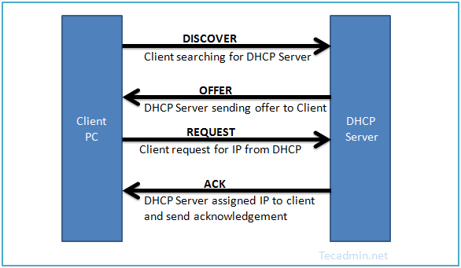
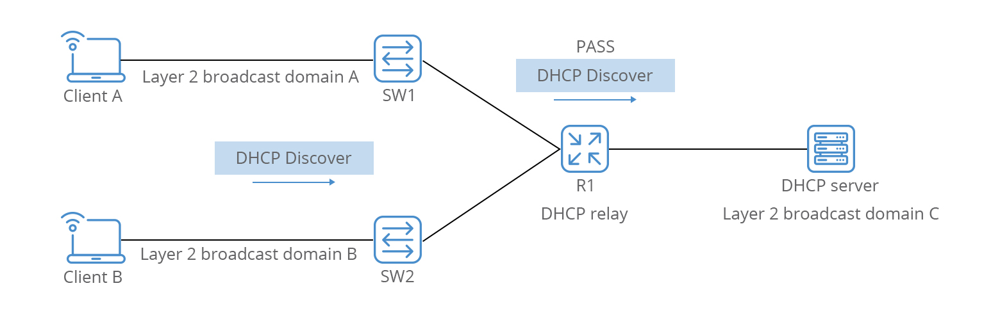
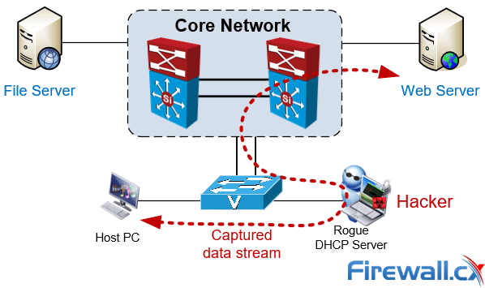
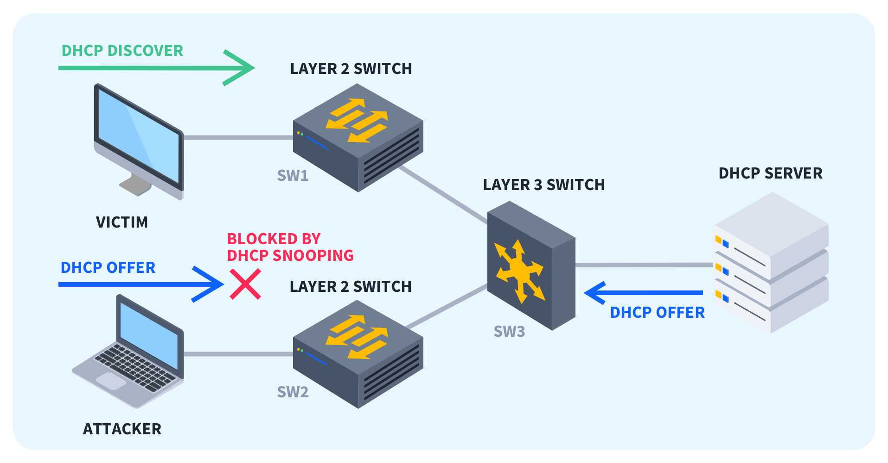

DHCP4 - funkce, možnosti konfigurace (rozsahy IP adres, dle MAC adresy), použití
===

Přehled
---

Velmi příjemná otázka. DHCP je jednoduchý protokol a lze o něm mluvit dlouho, navíc určitě můžete zapojit do svého výkladu i nějaké vysvětlení IPv4. Určitě doporučuji si nastudovat konfiguraci DHCP na Cisco routeru.

Povídání
---

Takže, povíme si něco o DHCP. K čemu vlastně slouží a co to vlastně je? Je to protokol aplikační vrstvy, který slouží k dynamickému nastavení IP adresy zařízení. Ovšem může zařízením poskytovat i jiné informace, jako třeba IP adresu brány, Domain Name Server, Time Server, Hostname, ...          
Dobře, kde můžeme takový server najít? Naprosto typicky ho může tyto služby poskytovat router. Třeba právě u vás doma. Sami určitě dobře víte, že když připojíte nové zařízení k síti, nemusítě mu konfigurovat IP adresu, aby mohlo síť využívat, ale je mu přidělena automaticky. To zařizuje právě DHCP. Lze ale samozřejmě tuto povinnost delegovat nějakému serveru.       
DHCP typicky využívá UDP port 67.           
Ukážeme si, jak probíhá proces získání IP adresy. Můžete ho vidět na obrázku níže.          
Nejprve počítač vyšle **DHCP Discover**. Tato zpráva je broadcast, protože počítač nezná IP adresu ani MAC adresu DHCP serveru. Tuto zprávu tedy vyšle všem serverům na síti.           
Všechny servery na ni odpoví **DHCP Offer**, ta je typicky zaslána jako unicast přímo zařízení, které chtělo IP adresu. Obsahuje možnou IP adresu, popř. jiné věci (options).       
Zařízení pak odpoví zprávou **DHCP Request**, která je vždy zaslána jako broadcast. Je to tak, protože touto zprávou zároveň odmítne případné nabídky ostatních DHCP serverů. Vzhledem k tomu, že DHCP Discover je také broadcast, pokud je na sítí více DHCP serverů, každý poskytne zařízení nějaký offer. Zařízení zpravidla přijme první z nich.            
Poslední využitou zprávou v tomto procesu je **DHCP Ack**. Tuto zprávu vyšle server klientovy a ukončí tak úspěšné půjčení adresy.          

Toto propůjčení samozřejmě netrvá věčně, ale lze jej prodloužit, což se také periodicky děje. Je také možné specifikovat, že určité mac adrese bude přidělena vždy určitá IP adresa.            
Na Cisco zařízeních je konfigurace DHCP velmi jednoduchá. Stačí specifikovat bazének IP adres, které chcete přidělovat. Předtím je ještě hodí z tohoto rozsahu některé adresy odstranit, aby je DHCP náhodou nepřidělilo, např. adresu brány. Směrovač už sám využije bazének na správné síťové kartě podle toho, na které je nastavena IP adresa ze sítě bazénku.          
Teď si řekneme o problému, o kterém by vás nenapadlo, že může existovat. Nicméně když vám to povím, určitě vám to bude přijít logické. DHCP Discover a DHCP Request jsou broadcast zprávy. Ty směrovač do jiných sítí nerozesílá. No, ale co když právě náš DHCP server je na jiné síti? Potom přichází na scénu DHCP Relay. Ten lze velmi jednoduše pomocí jednoho příkazu nastavit na routeru. Ten bude pak přeposílat DHCP zprávy i do jiných sítí.

To bylo k DHCP asi tak všechno, ale pro zajímavost si ukážeme nějaké útoky, které lze podniknout pomocí DHCP.           
Jedním z nich je tzv. **DHCP Spoofing**. Probíhá následovně: útočník svůj počítač nakonfiguruje tak, aby odpovídal na DHCP Discover zprávy. Když pak nějaká přijde, snaží se být rychlejší než opravdový DHCP Server v odpovědi. To není tak jednoduché, je-li server a útočník na jedné síti, ale pokud je server např. kdesi za DHCP Relayem, tento trik hned nabývá na užitečnosti. Útočník jako výchozí bránu uživateli řekne své IP. Tím efektivně veškerá komunikace klienta jde přes zařízení útočníka.                  

Druhým běžným útokem je **DHCP Starvation**. Útočník si pomocí fejkování MAC adres vypůjčí všechny dostupné IP adresy. Žádný další počítač tedy nemůže dostat IP adresu.        
Odpovědí na obě hrozby je tzv. **DHCP Snooping**. Lze ho nastavit na switchy a poskytuje takový základní firewall na určitých portech. Porty se dají označit jako trusted a untrusted. Untrusted porty bychom měli zpravidla nastavovat ty, které jsou připojené k zařízení, směrem k routeru.         
DHCP Snooping využívá tzv. DHCP Snooping Binding table. Tato tabulka vždy obsahuje přidělenou IP adresu, MAC adresu, dobu vypůjčení, VLAN, ... Přijde-li na takový untrusted port paket, který má jinou IP adresy, než která mu byla přidělena, okamžitě se zablokuje. Stejné chování nastane, přijde-li na untrusted port DHCP Offer, který tam nemá co dělat.     
Na untrusted portech lze také nastavit maximální limit DHCP zpráv za určitou dobu, takže tím DHCP snooping chrání před vyhladověním.           
O moc více toho vědět nepotřebujete.

Materiály
---
Jeremys's IT Lab - DHCP - https://invidious.privacyredirect.com/watch?v=hzkleGAC2_Y           
NetworkLessons.com - DCHP Messages - https://notes.networklessons.com/dhcp-message-types            
Incognito.com - DHCP Options - https://www.incognito.com/tutorials/dhcp-options-in-plain-english/           
RFC 2131 (DHCP) - https://datatracker.ietf.org/doc/html/rfc2131         
Jeremy's IT LAb - DHCP Snooping - https://invidious.privacyredirect.com/watch?v=qYYeg2kz1yE             
fiberroad.com - DHCP Snooping - https://fiberroad.com/resources/glossary/what-is-dhcp-snooping-and-why-should-you-use-it/
