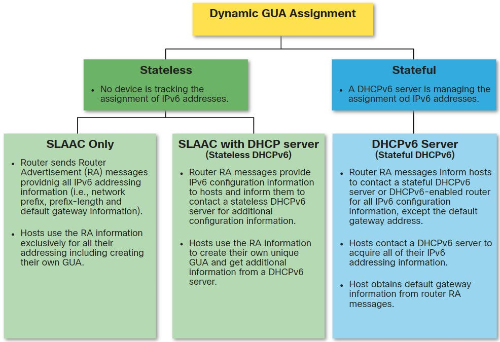

DHCP6 - funkce, možnosti konfigurace (rozsahy IP adres, dle MAC adresy), použití
===

Přehled
---

Jednoduchá otázka, lze o ní mluvit dlouho, přidat nějaký bullshit k IPv6, prostě pohoda.

Povídání
---

Takže, zopakujeme si trochu IPv6. Zařízení, které je připojené k IPv6 síti, potřebujeme především dvě adresy, GUA a LLA. LLA je schopné si vygenerovat samo. Síťovou část zná, protože je předem definovaná, a uživatelskou část si vytvoří. Lze ji vytvořit pomocí EUI-64, nebo náhodně vygenerovat. Následně se využije DAD, které vyšle NS zprávy, aby zjistil, zda není na sítí jiné zařízení se stejnou adresou.     
U Global Unicast adresy je to již trochu složitější. Neznáme totiž síťovou část IP adresy. Tu totiž musíme získat od našeho routeru. Získáme ji pomcí RA zprávy, kterou jsme si již vysvětlovali. Vytvoření uživatelské části pak vypadá analogicky k LLA.  

Na obrázku výše vidíte tři metody implementace DHCPv6. První z nich je pouze využití **SLAAC** (StateLess Address Auto-Configuration). SLAAC není nic jiného, než vytvoření GUA způsobem, který jsme si popsali výše. Zařízení se zkrátka spolehá na sebe a na prefix, který dostane of směrovače.          
DHCPv6 využívá 3 flagy. *A* (Autoconfiguration), *O* (Other) a *M* (Managed). Na základě toho, co přijde v RA zprávě, se zařízení rozhodne, jaký ze způsobů DHCPv6 využije. Přijde-li pouze vlaječka *A*, zařízení využije pouze SLAAC k nastavení své IP adresy. Přistane-li vlaječka *A* a *O*, počítač využije DHCPv6 Stateless server a SLAAC. Co znamená to stateless? Server si nevede žádné záznamy, nepamatuje si, komu co rozdává a je mu to jedno. Počítač využije prefix od routeru, vytvoří si adresu pomocí SLAAC, pak se doptá stateless serveru na doplňující informace, třeba na DNS server.            
Poslední možností je, když je přehozena pouze vlaječka *M*. To znamená, že počítač má použít k nastavení všeho včetně adresy stateful IPv6 server. Ten počítači dodá všechny potřebné informace. 

Materiály
---

CCNA SRWE - SLAAC and DHCPv6 - https://irkr.fei.tuke.sk/PocitacoveSiete/_materialy/Prednasky/pred_6%20SLAAC%20and%20DHCPv6.pdf      