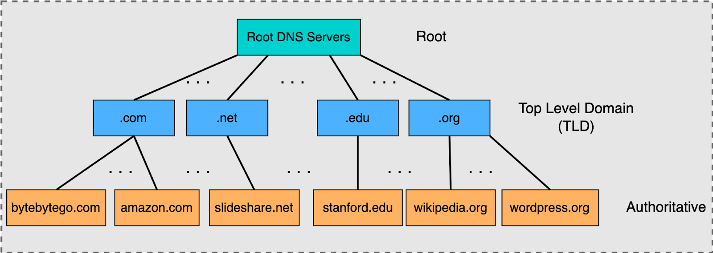
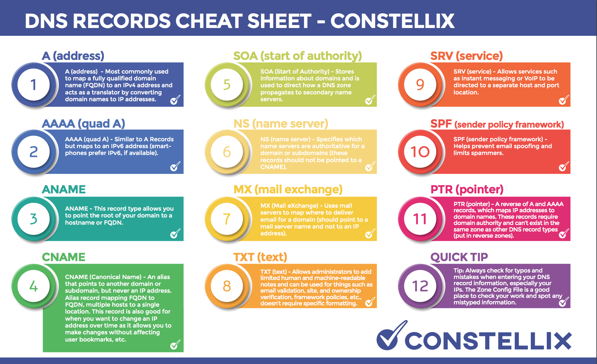

DNS - funkce, hierarchie (od souboru po globální DNS servery), konfigurace
===

Přehled
---

Zajímavá otázka. O DNS jde mluvit dlouho, nicméně mi to přijde jako trochu složitější téma. Hierarchiií a typy záznamů ale určitě půjde několik minut zaplnit.

Povídání
---

Začneme jednou věcí, kterou je třeba si uvědomit. Váš počítač nemá páru, jakého zařízení se má na stránku dotázat, když do adresního řádku napíšete *xvideos.com*. Je to pouze doménové jméno. Jak jsme již probrali, počítače se řídí IP adresami, MAC adresami a porty, nikoliv doménovými adresami. Nicméně vy byste si určitě nechtěli pamatovat IP adresu každé stránku, na kterou běžně chodíte. Proto máme DNS (Domain Name System).             
DNS dělá především jednu věc, překládá doménové adresy na IP adresy. 

Nejlépe to pochopíte, když si to ukážeme na konrétním příkladu. V první řadě potřebuje zařízení nějaký DNS resolver. Na počítačí bývá tzv. stub resolver (třeba dnsmasq, nebo nějaký poskytovaný přímo OS). Ten konzultuje s rekurzivním resolverem (recursorem).       
Zadáme-li do adresní řádky našeho oblíbeného vyhledavače (jestli je to Edge, tak se nad sebou zamyslete a pak začněte používat něco jiného) *xvideos.com*, stub resolver vyšle dotaz na rekurzivní resolver, aby tuto adresu přeložil.          
Rekurzivní resolver se nejdříve zeptá jednoho z kořenových serverů, na jakém serveru najde top level doménu (.com, .net, ...). Těchto kořenových serverů je po světě 13, jsou strategicky postavené a spravované 12 různými organizacemi. Takže docela real shit.           
Kořenový server odpoví rekurzivnímu serveru adresou TLD (Top Level Domain) serveru. Teď velmi důležitý point, abyste to u maturity totálně neposrali. Kořenový server se neptá TLD serveru! Vždycky se ptá jenom rekurzivní server a ostatní servery mu odpovídají. Je to tedy takový ping-pong. TLD server tedy odpoví rekursoru IP adresou serveru, který zná IP adresu pro doménu *xvideos.com*.     
Tento server se nazývá autoritativní. Poskytuje IP adresy pro konkrétní doménu, v tomto případě *xvideos.com*. Může mít poddomény, třeba *latinas.xvideos.com*. Tento server tedy vrátí dotazovanou IP adresu a rekurznivní server ji zašle zpátky stub resolveru na počítači. Ten se konečně dostane na stránku.           
Aby se tento dlouhý proces nemusel opakovat, stub resolver lookup zacachuje. Pokud pak uděláte nslookup na doménu, uvidíte u ní napsané *non-authoritative*. To znamená, že byla zachachovaná, odpověď tedy nebyla získána z autoritativního serveru, proto non-authoritative.                    
Existuje i pojem DNS zóna. Ta označuje doménu, nebo sadu domén, které zpravuje jeden administrátor. Nepotřebujete vědět, jak přesně to funguje k maturitě.

Jak DNS server vlastně resolvuje doménové adresy? Má uložené různé záznamy. Na obrázku výše vydíte všechny z nich, nicméně nás všechny zajímat nebudou.         
Důležité pro nás jsou záznamy *A*. Ty mapují doménovou adresu k IPv4 adrese.        
Analogicky fungují záznamy *AAAA*. Ty mapují doménovou adresu k IPv6 adrese.            
*TXT* může být nějaká zpráva uložená na serveru.        
*MX* je adresa mailového serveru pro danou doménu. Možná se k ní vrátíme u otázky k mailům.         
Ostatní záznamy a jejich funkci si můžete pročíst sami.         
Jako DNS server může fungovat i náš router. Pokud ho tak nastavíme, můžeme mu např. přidat záznam, kde hostname *H2* mapujeme k adrese *192.168.0.59*. Na zařízeních na síti nastavíme tento router jako DNS server a může na nich směla používat *H2* k přístupu k tomuto zařízení.            
Je také důležité na tomto routeru nastavit rekurzivní DNS server, které se router zeptá, jakmile nebude moci nějakou adresu přeložit. 

Materiály
---

Jeremy's IT Lab - DNS - https://inv.nadeko.net/watch?v=4C6eeQes4cs              
PowerCert - How a DNS server works - https://inv.nadeko.net/watch?v=mpQZVYPuDGU                 
PowerCert - DNS Records Explained - https://invidious.jing.rocks/watch?v=HnUDtycXSNE