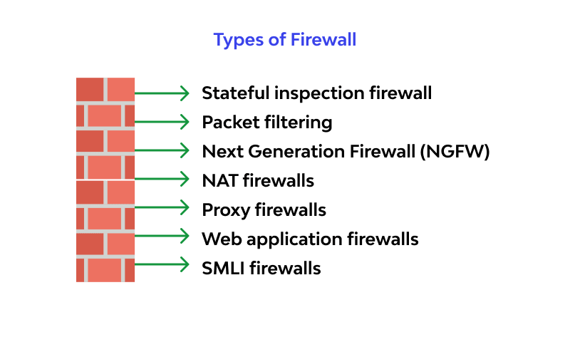
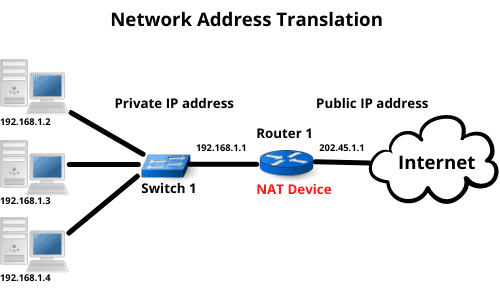
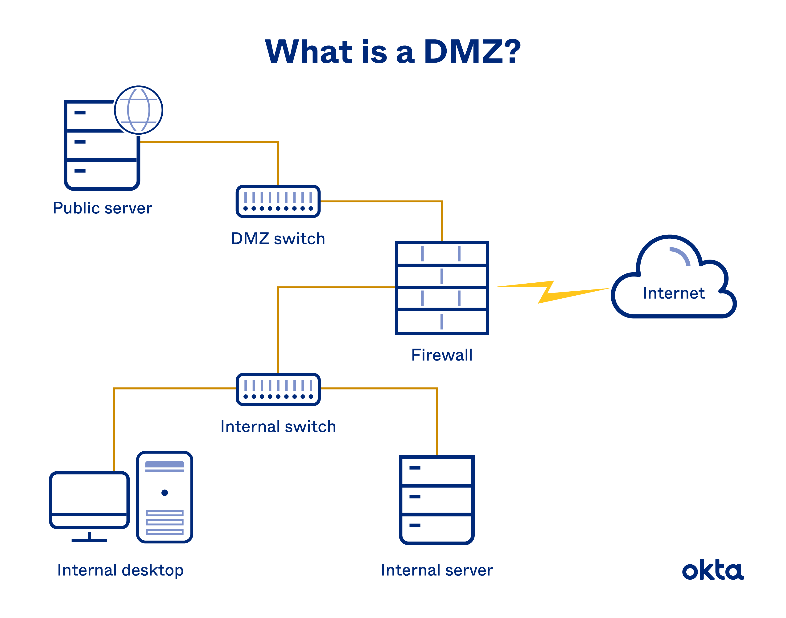
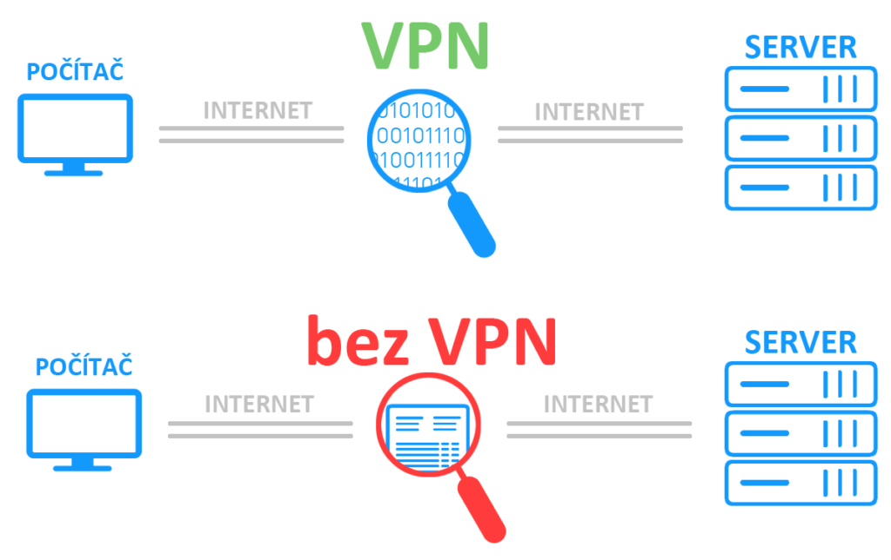

Firewall - Principy fungování, typy firewallů (stateful, stateless, aplikační), konfigurace pravidel, NAT, DMZ, VPN
===             

Přehled
---

Velmi rozsáhlá otázka, zde se dá mluvit o velké spustě věcí. Nepopsal bych ji jako jednoduchou, prozatím jsme firewally probírali jen velmi střídmě.

Povídání
---

Firewall, je speciální zařízení, nebo software, který má za úkol nás ochránit před celou plejádou kybernetických útoků. Od DoSu přes nebezpečná macra po soubory a komunikaci. Představíme si základy jeho fungování, jeho typy a koncpety, které se neodmyslitelně pojí také s kybernetickou bezpečností, NAT, DMZ a VPN. Kdo bude chtít, poskytl jsem v materiálech videa na ACL (Access Control List). Ty zde jen okrajově zmíním, nicméně konfiguraci nechám na vás, pokud se o to budete zajímat.         
Jak jsem již zmínil, firewall může být buď samotné zařízení na síti, nebo software (třeba Windows Defender). Síťový firewall se rozšiřitělnější, protože jeho pravidla mají dopad na celou síť. Ještě předtím, než si řekneme o nějakých složitějších a důmyslnějších ohnivých stěnách, ukážeme si ten nejjednoduší firewall, packet filtering. Takový packet filtering dovede třeba právě ACL. Můžete filtrovat jednotlivé pakety na základě různých kritérií, source IP address, destination IP address, portů, .. Typicky existují dvě možnosti, black-list a white-list. U té první specifikujeme, které pakety se mají zahodit. Přijde-li paket, pro kterého neexistuje pravidlo, je vpuštěn. V druhém případě je to opačně. Jsou vpuštěny pouze pakety, které jsou specifikovány v pravidlech.            
U ACL je ještě důležité si uvědomit, že list pravidel je procházen postupně. Musíme ho tedy poskládat s dobrým rozmyslem, nejlépe pak pro jistotu ozkoušet.             
V Linuxu je jednoduchý firewall zajištěn pomocí iptables, pokud vás to zajímá, můžete si pogooglit.         

Na obrázku výše můžete pro ilustraci vidět spoustu typů firewallů. My si ukážeme jen ty, které zmiňuje otázka. Tedy stateful, stateless a aplikační.        
Abychom pochopili fundamentální rozdíl mezi stateless and stateful firewallem, zopakujme is trochu TCP spojení. Při vytvoření spojení máme vlastně zpojení dvě, my k serveru a server k nám. Pro nás jde spojení ven, je outbound. Pro server jde připojení dovnitř, je inbound. Stateless firewall neznám pojem spojení, každý paket je pro něj individuální. Pokud tedy chceme tuto komunikaci povolit, musíme povolit jak odchozí, tak příchozí paket.               
Na druhé straně stateful firewall umí pracovat se spojením. Lze u něj tedy povolit, nebo zakázat celé spojení bez nutnosti dvou separátních pravidel. Stateful firewall umí samozřejmě i spoustu jiných věcí v rámci monitorování komunikace.           
Jeden z firewallů si také určitě zaslouží zmínku, to je NGFW (Next-Genertion FireWall). Klasicky firewall se dokáže řídit maximálně podle informací dostupných na transportní vrstvě, tedy portů, a informací na síťové vrstvě, tedy IP adres. Nicméně ne každý protokol vždy bývá na svém portu, typicky třeba SSH často kvůli bezpečnosti využívá jiný port. Proto mám NGFW. Ten dokáže kontrolovat i informace obsažené na aplikační vrstvě, takže se dovede irientovat i podle protokolu.           
Aplikační firewally jsou podobné těm klasickým, ale jsou specializované na nějakou aplikace, třeba WAF (Web Application Firewall). Ten kontroluje především traffic webových protokolů a poskytuje k tomu patřičné nástroje.        
Určitě stojí za zmínku, že lze si firewall zařídit jako takový proxy server před vaším počítačem. Všechen traffic tedy lítá přes tento proxy server, který se zvenku tváří jako váš počítač. To může velmi značně zvýšit vaše zabezpečeni, nicméně existují aplikace, které mají s tímto přístupem problém a budou špatně fungovat.          

Další z věcí, kterou mohou firewally nebo routery dělat, je NAT. Už jsme o něm slyšeli, když jsme mluvili o IPv4. Využívá se k jedné zásadní věci, dovoluje několik interním IP adresám se tvářit jako jedna externí. Tedy, NAT znamená Network Address Translation, což nutně nemusí implikovat tuto skutečnost.           
Existuje i NAT, který každou adresu vnitřní zkrátka přeloží na jinou vnější z nějakého poolu adres, které má dispozici. Ale to nám pak žádné adresy opravdu neušetří.               
Cisco říká té klasicky využívané verzi NATu PAT (Port Address Translation). A také se portů týká. Router se zvenčí tváří jako jedna IP adresa, každá komunikace, kterou nějaké vnitřní zařízení navázalo z vnějškem, je dáno na jiný port. Router si pamatuje, který port patří které interní IP adrese. Nu a takto jsme jednoduše dosáhli toho, že můžeme z několika adres udělat jednu.           
Jenže ono to není tak úplně sluníčkové. Ano, dává nám to také jistou formu soukromí, protože zvenčí se na naši adresu, aniž bychom sami komunikaci začali, nikdo nedostane. Jsme tzv. za NATem. Nicméně ani my se k našemu zařízení nedostaneme. Další nepříjemností je, že často se ocitneme i za několikanásobným NATem, což může působit velké problémy, chceme-li třeba využít nějaké naše zařízení jako server. NAT navíc zpomaluje komunikaci, router má samozřejmě konečný počet portů, takžé máme i konečný počet spojení, které můžeme NATovat.            
Nicméně dnes je NAT ještě standart, takže je dobře o něm vědět. IPv6 NAT nepotřebují!           

DMZ (DeMilitarized Zone) je speciální koncept, který se často využívá např. ve firmách. Pokud máme webový server, který využívá pravidelně hodně lidí, určitě ho nechceme dát za náš firewall, dovolili bychom tak útočníkům se přes něj dostat až do naší interní sítě. Takové servery se proto dávají PŘED firewall firemní sítě, ještě se naprosto typicky dává jeden firewall před tyto servery. Zde již nehrozí takové nebezpečí napadení.         

VPN (Virtual Private Network) je technologie, která nám dovolí vytvořit bezpečný tunel skrz nebezpečnou síť (třeba internet). Podíváme se na tuto hračku jen tak okrajově, nebude třeba ji umět nakonfigurovat. Jak tohoto tunelu dosáhne? Nu, zašifruje celý obsah paketu a obdaří ho další hlavičkou, která jej nejdříve navede na VPN server. Tam je obsah odšifrován a zaslán na požadovanou destinaci. Oblíbeným protokolem, který se používá pro VPN, je IPSec.

Materiály
---

PowerCert - What is a Firewall - https://invidious.perennialte.ch/watch?v=kDEX1HXybrU           
PowerCert - What is DMZ - https://invidious.perennialte.ch/watch?v=dqlzQXo1wqo          
Professor Messer - Firewall Types - https://invidious.perennialte.ch/watch?v=mq1HRM-zGtQ            
Professor Messer - Firewalls - https://invidious.perennialte.ch/watch?v=VgNyh4HEqSU         
Professor Messer - Network Address Translation - https://invidious.perennialte.ch/watch?v=UILwCNOC5EI           
PowerCert - NAT Explained - https://invidious.perennialte.ch/watch?v=FTUV0t6JaDA        
Jeremy's IT Lab - NAT Part 1 - https://invidious.perennialte.ch/watch?v=2TZCfTgopeg     
Jeremy's IT Lab - NAT Part 2 - https://invidious.perennialte.ch/watch?v=kILDNs4KjYE             
Jeremy's IT Lab - WAN Architectures - https://invidious.perennialte.ch/watch?v=BW3fQgdf4-w          
PowerCert - VPN Explained - https://invidious.perennialte.ch/watch?v=R-JUOpCgTZc            
PowerCert - IPSec Explained - https://invidious.perennialte.ch/watch?v=xTH1ZA_qUvA          
Jeremy's IT Lab - Standard ACLs - https://invidious.perennialte.ch/watch?v=z023_eRUtSo          
Jeremy's IT Lab - Extended ACLs - https://invidious.perennialte.ch/watch?v=dUttKY_CNXE          
Fortinet - How does a firewall work - https://www.fortinet.com/resources/cyberglossary/how-does-a-firewall-work             
LearnCantrill - Stateful vs Stateless Firewall - https://invidious.jing.rocks/watch?v=rL4-vbsN35w