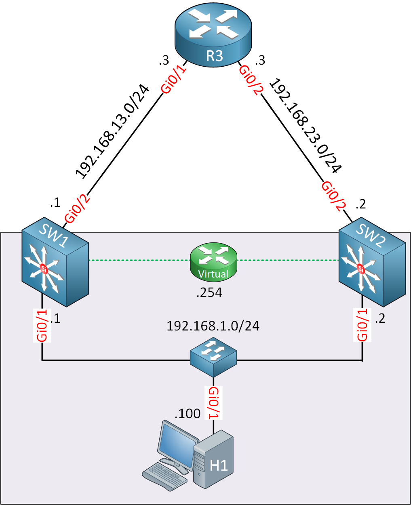
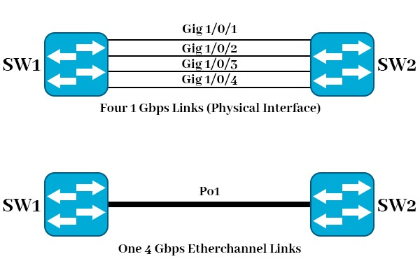
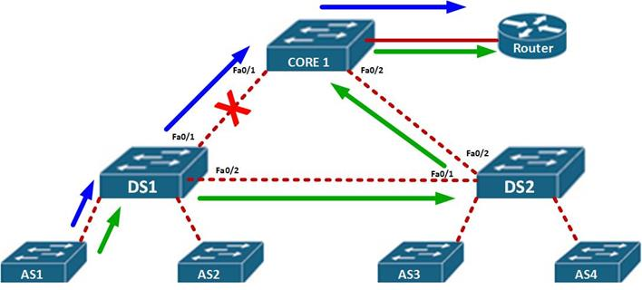

STP (Spanning Tree), Etherchannel a HSRP - principy, konfigurace, failover a redundance, BPDU
===

Přehled
---
Velmi pěkná otázečka. Tři technologie, o kterých se dá mluvit opravdu dlouho. Nicméně tady bude snad stačit jen u každého sumarizovat využití a princip fungování a máte vystaráno.

Povídání
---

Začnu trochu od zadu, ukážeme si FHRPs (First Hop Redundancy Protocols). Určitě víte, že kdyby se vám náhodou rozbil domácí router, tak jste úplně v hajzlu a nemáte internet. To sice nasere, ale nasere to jenom vás, takže to není takovej průser. Kdyby se něco podobného ale stalo v nějaké kritické síti, možná by to mohlo nasrat značně víc lidí. Proto potřebujeme FHRP. Místo jednoho routeru, single point of failure, můžeme zapojit více routerů. Jiné nahradí ten primární v případě výpadku.         
Existují 3 hlavní protokoly, které se využívají pro tento účel. **HSRP** (Hot Standby Router Protocol), **VRRP** (Virtual Router Redundancy Protocol) a GLBP (Gateway Load Balancing Protocol). Jednoduše, HSRP a GLBP je Cisco proprietární. Nám stačí znát, jak nakonfigurovat HSRP. VRRP je otevřený standart a měl by fungovat zhruba analogicky k HSRP.        

Osvětlím, jak plus minus tyto protokoly fungují. K maturitě asi nemusíte vědět přesně, jak konkrétní protokol funguje, ale obecné představa se bude hodit. Každý router musí mít svou IP adresu a MAC adresu. FHRP využívá jednu virtuální IP adresu, která se na zařízeních nastaví jako brána a je sdílena mezi routery na síti. FHRP také využívají virtuální MAC adresu, ale její funkci znát nemusíte.            
Router může být muď standby, nebo active. Aktivní router odpovídá na zprávy a funguje jako normální router. Aktivní router si posílá hello zprávy mezi standby routery. Pokud standby router po předem určenou dobu nedostane žádný hello packet, převezme roli aktivního směrovače.        
Počítači tedy stačí znát pouze virtuální IP adresu. Zbytek si řeší směrovače nastavené s FHRP.          
Další techonolgií, kterou si zmíníme, je EtherChannel. Trochu se předběhnu, ale záhy si to vysvětlíme. Pokud nám mezi dvěma switchy nestačí jeden link, protože na něm běhá opravdu hodně dat, co uděláme? Můžeme přidat další link, ano. Co se ale stane? Vznikne smyčka a STP jednu z linek zablokuje. Takže stále máme jenom jednu linku .. Na pomoc nám přichází právě EtherChannel.

Existují dva protokoly, které dokáži napomoct vytvoření EtherChannelu, nebo lze etherchannel vytvořit staticky. Etherchannel se tedy stará o agregaci portů, udělá z více portů jeden virtuální. Na těchto portech dělá také jednoduchý load balancing. Komunikace mezi jedním počítačem a serverem chodí přes jeden link, druhá komunikace přes druhý. Pomocí EtherChannel lze spojit 8 portů, s využitím PAgP nebo LACP až 16 portů. Pro EtherChannel je naprosto klíčové, aby všechny porty na obou stranách měly naprosto stejnou konfiguraci, včetně duplexity, rychlosi, vlanů, ...           
**PAgP** (Port Agreggation Protocol) je první z protokolů, které se dají využít pro vytvoření EtherChannelu. Je to Cisco proprietární protokol. Set portů lze nastavit jako *auto*, nebo *desirable*. Auto znamená pasivní, porty čekají, až je kontaktuje set portů, které jsu nastavené jako desirable a aktivně se snaží vytvořit EtherChannel.          
Druhým protokolem je **LACP**. To je otevřený standart. Funguje stejně, nicméně zde jsou port módy *active* a *passive*.        
EtherChannel jde nastavit i staticky, zkrátka řeknete, že set portů bude EtherChannel, a to samé řeknete i druhému switchy s totožným nastavením portů.         

Zbývá nám již je STP (Spanning Tree Protocol). Využívá se k zablokování smyček na druhé síťové vrstvě. Rámce totiž nemají žádný mechanismus, který by jim dovolil zmizet ze sítě v případě, že se někde zacyklí. Zacyklí-li se paket, TTL nebo HL způsobí, že dříve nebo později bude zahozen. Rámec ne, ten může lítat na síti donekonečna. Pokud tedy vznikne smyčka, je zacyklen a zbytečně zahlcuje síť.        
Budu trochu lenoch a nechám vás si nastudovat konkrétní detaily funkce sami. Představíme si tu ale základní principy, jako u minulýh protokolů.             
STP se již dlouho nevyužívá, Cisco defaultně využívá  **Rapid PVST+**. PVST je Per-VLAN Spanning Tree. Existuje ještě **MSTP**, což je moderní otevřený standart.           
Jak STP funguje? Nejdříve je potřeba zvolit tzv. Root bridge. Každý jiný switch musí mít cestu právě k tomuto switchy. Typicky toto bude switch s nejnižší prioritou, popř. s nejnižší MAC adresou.             
Každý port může být buď designated, root, nebo blocked. Root porty jsou vždy naproti designated. Spanning tree zkrátka pomocí posílání BPDU zablokuje v síti smyčky a dokáže reagovat i na změny topologie.             
Na portech, kam jsou připojeny počítače, by měl být spanning tree vypnut kvůli možným útokům. Toho dociluje BPDU Guard, který port vypne, přijde-li na něj BPDU.

Materiály
---
Jeremy's IT Lab - Spanning Tree Protocol Part 1 - https://invidious.jing.rocks/watch?v=j-bK-EFt9cY         
Jeremy's IT Lab - Spanning Tree Protocol Part 2 - https://invidious.jing.rocks/watch?v=nWpldCc8msY          
Jeremy's IT Lab - Rapid STP - https://invidious.jing.rocks/watch?v=EpazNsLlPps              
Jeremy's IT Lab - EtherChannel - https://invidious.jing.rocks/watch?v=xuo69Joy_Nc           
Jeremy's IT Lab - First Hop Redundancy Protocols - https://invidious.jing.rocks/watch?v=43WnpwQMolo         
CCNA SRWE - Module 5: STP - https://www.ccri.edu/faculty_staff/comp/jmowry/CNVT_1820_Power_point_2018/SRWE_Module_5.pptx            
CCNA SRWE - Module 6: EtherChannel - https://www.ccri.edu/faculty_staff/comp/jmowry/CNVT_1820_Power_point_2018/SRWE_Module_6.pptx               
CCNA SRWE - Module 9: FHRP - https://www.ccri.edu/faculty_staff/comp/jmowry/CNVT_1820_Power_point_2018/SRWE_Module_9.pptx       