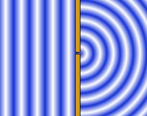
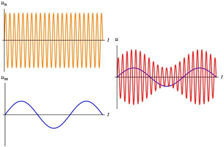
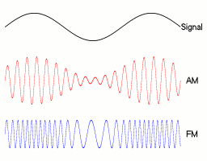
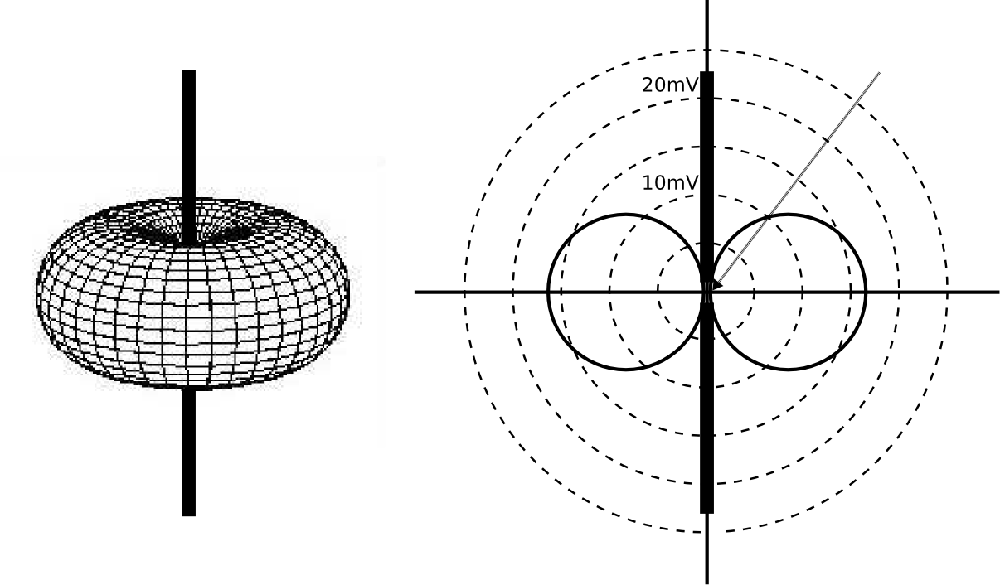
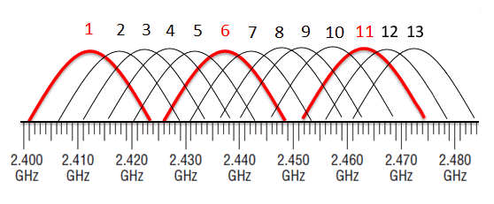
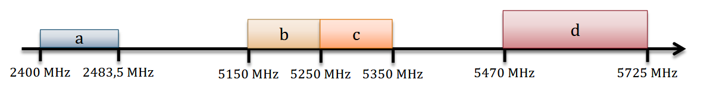

Bezdrátové sítě - šíření elektromagnetických vln, antény, druhy modulací, zabezpečení, autentifikace
===

Povídání
---

Začneme úplně od začátku, od fyziky. Nebo ....                   
Dobře, když jsme si teď pověděli nějaký fyzikální základ, můžeme pokračovat. Začneme úplně od začátku. V dávných časech si nějaký pán uvědomil, že když tento zdroj střídavého proudu přivedený na nějakou anténu vypíná a zapíná, generuje nějaké signály. Tyto signály ale neměly žádný specifický tvar, druhá strana je mohla zkrátka buď zachytit, nebo ne. Bylo přes ně tedy možné komunikovat jen pomocí nějakého speciálního jazyka, typicky pomocí morseovky. Tento systém se docela uchytil, bylo možné s ním komunikovat na dlouhé vzdálenosti, byl jednoduchý. Nicméně měl nespočet nevýhod. Jednou z nich byla rozhodně neschopnost vypořádat se s nějakým rušením, jiným signálem.                     
Než se podíváme dál, vysvětlíme si, spíš polopaticky než vědecky, co se může signálu stát, když tak putuje vzduchem.            
**Absorbce**. Můžeme mít v cestě třeba nějakou stěnu, ta dovede signál absorbovat, ztlumit. To je významné především u signálů vyšších frekvencí. Tyto signály tak hůře penetrují skrze zdi a nehodí se na dálkové vysílání. Absorbovat může i např. kovový povrch. Absorbovaná energie se zpravidla mění v teplo.              
**Reflekce**. Třeba kovový povrch ale dovede i signál reflektovat, tedy odrazit.                
**Refrakce**. Ta nastává, když se vlny dostanou do jiného materiálu než vzduchu. Světlo putuje v různých materiálech různou rychlostí. Signál tak může např. změnit směr. Podobně jako se může i viditelné světlo různě lámat.          
**Difrakce**. Je specifická vlastnost vln. Vlna za úzkým otvorem opět propaguje do všech stran, ne pouze směrem otvoru. Obrázek popíše nejlépe.             

**Tříštění**. Mluví samo za sebe. V některých případech se nám signál může roztříštit.                  
Dobře, máme možnost, jak komunikovat na dálku. Nicméně morseovka je docela lame, ne? To si řekl i někdo na začátku 20. stol. A opravdu, dovedl přenést analogový signál. Jak toho docílil? Využil tzv. amplitudovou modulaci. Co to je modulace? Modulace, alespoň jak jsem to já pochopil, je zakódování informace do nosné vlny. Co je nosná vlna? To je vlna pevně dané frekvence. Vysíláč do ni zakóduje informaci a přijímač zná frekvenci této vlny a dovede z výsledné vlny informaci dekódovat.                 

Provádíme-li amplitudovou modulaci, výsledný signál získáme složením nosné vlny a našeho signálu. Nosná vlna změní amplitudu podle průběhu našeho signálu. Tato modulace se stále v některých aplikacích využívá. Nicméně většině světa vládnou efektivnější modulace.          
FM funguje podobně jako AM, nicméně místo amplitudy mění frekvenci podle našeho signálu.        

Existuje ještě PM modulace, neboli fázová modulace. Tu si nebudeme více vysvětlovat, nicméně je základem moderních typů modulací jako QPSK, 8-PSK a QAM.                    
Pobavíme se teď trochu o anténách. Ty jsou základem šíření elektromagnetických vln. Podle ní se řídí směr a síla vyzařování, také frekvenci.                    
Každá anténa má svůj vysílací výkon a vyzářený výkon. Vysílací výkon je jen jeden. Je to celkové množství energie, které zařízení generuje. Vyzářený výkon už má svůj směr. Je to výkon, který je vyzářen do konkrétního směru. Každá anténa má pak svou vyzařovací charakteristiku. Může vypadat třeba takhle:

Vysílací výkon je měřen v dBm (decibel milliwatt). Co to znamená? Decibel je jednotka, kterou jistě známe ze studia hluku. Vyjadřuje zlogaritmovaný poměr mezi dvěma hodnotami. Následovně: **10 * log(P1/P2)**. Potřebujeme tedy nějakou referenční hodnotu, od které se bude odvíjet síla ostatních. Touto hodnotou je 1 milliwatt. Posílali-li bychom tedy do antény 1 milliwatt, její vysílací výkon by byl 0 (Protože logaritmus 1 je 0).                  
Podobně se měří i zisk antény. Ten se měří v dBi (decibell isotropic). Co je referenční hodnota zde? Představme si ideální bodovou anténu. To je taková anténa, která do všech směrů vysílá stejně silně, tj. její vyzařovací charakteristika je koule. Takový bod v realitě neexistuje, vždy anténa někam vyzařije více a někam méně. Referenční hodnota tady je výkon, kterým by při stejném celkovém vyzařeném výkonu, zářila do tohoto směru izotropní anténa. To je sice docela abstraktní, nicméně k porovnání antén se to docela hodí.                   
Lze ještě vypočítat tzv. EIRP (Effective Isotropic Radiated Power). Vypočítáme ho prostým sečtením vysílacího výkonu, zisku antény a ztrát (třeba v kabelech). Sčítáme decibely, to je bezrozměrná jednotka, výsledkem je tedy opět bezrozměrná jednotka, dBm. Udává, jaký výkon by musela vyzářit izotropní anténa, aby dosáhla stejné intenzity vyzařování ve směru nejvyššího zisku naší antény. Zní to složitě, já vím. Nicméně k maturitě se tím nejspíš nemusítě zbytečně moc zabývat.                                      
Existují zákony, která regulují EIRP. Takže na to je dobré si dát pozor.                    
Teď už dost antén, vrhneme se na samotné Wi-fi. To pracuje v tzv. bezlicenčních pásmech. To jsou pásma, u kterých nepotřebujeme žádný certifikát k jejich využívání. To samozřejmě neznaméná, že si v nich můžeme dělat co chceme. Nicméně to znamená, že v nich nejsme ani zdaleka sami a musíme si dávat pozor třeba na rušení.                   
Pro WLAN (Wireless Local Area Network) existuje více standartů. Nicméně pro nás je důležité jen Wi-fi, formálě IEEE 802.11. Většina ostatních standartů buď zahynula nebo zkrátka nefungovala.          
Wifi pracuje především ve dvou pásmech. Prvním je pásmo od 2.4GHz do 2.4835GHz. Má tedy velikost 83.5GHz. Druhé pásmo, které dnes není spojité, je pásmo 5GHz (pozor, nepleťte si 5GHz s 5G. 5G sítě pracují se značně vyššími frekvencemi. 5 v tomto případě označuje verzi, nikoliv frekvenci jako u 5GHz pásma). Toto pásmo je od 5150MHz do 5350MHz a od 5470MHz do 5725MHz. Existuje ještě třetí pásmo, 57-66 GHz, nicméně jeho využití jsem v praxi nikde neviděl.                    
Začneme s pásmem 2.4GHz. V tomto pásmu pracuje třeba Bluetooth. Ten si ho rozdělil na 79 kanálu a mezi nimi při komunikaci různě skáče pomocí Frequency Hoppingu. Skáče takto např. proto, aby se zabránilo zbytečnému rušení. V tomto pásmu se také nacházejí vlny, které využívá mikrovlnka (asi okolo 2450MHz). Nás to zatím neupeklo, takže by to mělo být bezpečné :).     
V ČR máme toto pásmo rozdělené do 13 kanálů. Tyto kanály jsou od sebe 5MHz a mají 22MHz, takže se překrývají. Vybíráme-li si tedy kanály, na kterých budeme fungovat, měli bychom si vybrat takové, které se nepřekrývají (třeba 1, 7 a 13).                

V pásmu 5GHz je kanálů značně více, jsou ale užší (20MHz).                          

Využití různých pásem může mít svá pravidla. Např. pro pásma c a d mají povinný TPC (Transmit Power Control .. uzel vysílá jen tak silně, jak je zapotřebí). Pásma mají také různý EIRP, nebo zda mohou být použiti i "outdoor".                    
Obecně, nižší frekvence lépe pronikají překážkami, protož 2.4GHz lépe chytíte na delší vzdálenosti. 5GHz bývá ale mnohem méně rušené má více frekvenčních kanálů.               
Představíme si teď několik technik v radiovém přenosu. První z nich je již zmíněný FHSS (Frequency Hopping). Zkrátka v čase přeskakujeme mezi frekvencemi. Starší verze IEEE 802.11 ji využívaly, neosvědčily se ale.                   
FDM a OFDM. Laicky řečeno, když letí signál, může se různě odrážet a přijít do přijímače několikrát. Jen s fázovým posunem a jinou amplitudou. To může být problém při následném dekódovaní. Lze to řešit rozdělením komunikace do několika komunikací. Tak to řeší FDM (Frekvenční multiplex). To je ale velmi energeticky náročné. V praxi se tedy využívá OFDM. To je ale zbytečně komplexní, takže ho tu nebudeme probírat více.                
K mitigaci vlivu šumu lze využít tzv. DSSS (Direct Sequence Spread Spectrum). V podstatě to znamená, že 1 a 0 zakódujeme do delšího znaku.                  
Na začátku byl standart IEEE 802.11. Využíval DSSS a FHSS. Už v době svého přijetí byl na piču. Proto se záhy vytvořily dvě nové verze. 802.11a a 802.11b.              
První z nich je v pásmu 5GHz. Dosahoval dobrých rychlostí (54Mb/s) a využíval techniku OFDM.                     
Druhý z nich pracoval v pásmu 2.4GHz a využíval DSSS (nicméně efektivnější než původní standart). Dosahoval menších rychlostí (11Mb/s).             
Vyšších rychlostí se dosahovalo mimo jiné díky velmi chytrému kódování, které dovedlo do jedné vlny zakódovat hned několik bytů (BPSK, QPSK, QAM).                      
Protože 802.11a vznikl v US, neměl žádné zvláštní ekologické požadavky. To ale u nás v EU nepřošlo, takže v roce 2004 vznikl 802.11h, který měl mít povinně zabudované např. DFS (automatické vystřídání kanálu, detekujeme-li jiné zařizení na tom našem) a TPC (zařízení se dohodnou na síle signálu pro minimalizaci energií signálu kvůli případnému rušení). Ostatní charakteristiky jsou shodne s 802.11a.                    
802.11g je snaha zrychlit 802.11b pomocí novějších protokolů. Je sice zpětně kompatibilní s DSSS, ale nově využívá i OFDM nebo PBCC.                    
Dalším standartem, který si zmíníme, je 802.11n. Ten přináší možnost využít obě pásma. Také využívá metodu MIMO (Multiple Input Multiple Output). To znamená využití několika antén současně.               
Existuje ještě 802.11ac. Tento stadart přináší teoretické zrychlení až na 1Gbit/s. Využívá širší frekvenční kanály (80MHz minimálně). Zná i techniku tzv. beamformingu.                 

Materiály
---

Jeremy's IT Lab - Wireless Fundamentals - https://invidious.jing.rocks/watch?v=zuYiktLqNYQ          
Jeremy's IT Lab - Wireless Architectures - https://invidious.jing.rocks/watch?v=uX1h0F6wpBY             
Jeremy's IT Lab - Wireless Security - https://invidious.jing.rocks/watch?v=wHXKo9So5y8                  
Jeremy's IT Lab - Wireless Configuration - https://invidious.jing.rocks/watch?v=r9o6GFI87go                 
Computer Science Lessons - Wireless Communication - https://www.youtube.com/watch?v=OLsbONSQFUI&list=PLTd6ceoshprdYxPhsPcR6yWLMeqsU3t9M         
shopdelta - Zisk izotropni anteny - https://shopdelta.eu/dbi-energeticky-zisk-izotropni-anteny_l8_aid836.html                       
