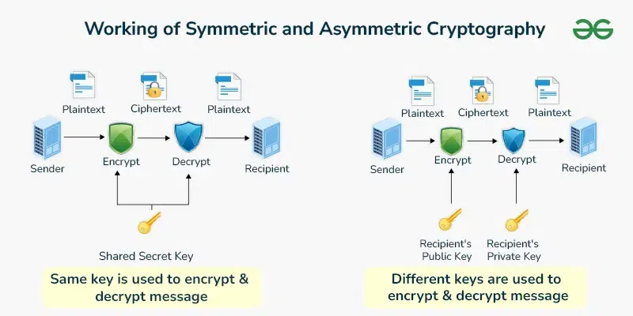
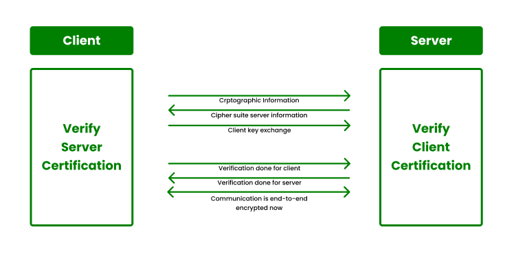

SSL/TLS, RSA - Symetrické a asymetrické šifrování, SSL/TLS handshake, certifikační autority
===

Přehled
---

Relativně pěkná otázka, nicméně šifrování není žádná triviální věc, takže hodně štěstí.

Povídání
---

Začneme rozdílem mezi symetrickým a asymetrickým šifrování.             

Symetrické šifrování pravděpodobně to, co si přestavíte jako první. Máme nějaký klíč, pomocí kterého zašifrujeme nějakou zprávu. Tuto zprávu lze rozšifrovat opět pouze tímto klíčem. Nevýhodou je, že pokud se k tomuto klíči dostane někdo, kdo ho zneužije, máme po ptákách. Velkou výhodou ale je, a je to také důvod, proč se symetrické šifrování stále aktivně používá, jeho rychlost.           
Asymetrické šifrování funguje trochu jinak. Využívá principu veřejného a privátního klíče. Veřejný klíč se používá k šifrování zprávy, privátní klíč zprávu rozšifruje. Privátní klíč byste nikdy neměli nikomu ukazovat, posílat. Je váš, jenom váš. Veřejný klíč můžete zaslat, komu chcete, nemůže nikomu ublížit. Ten se využívá pouze a jenom k zašifrování zprávy. Velkou nevýhodou asymetrického šifrování je především šifrování a rozširování, která je díky často velkým klíčů dosti dlouhá.          
Díky atributům obou metod šifrování se často využívá společně. Právě to si ukážeme ve spojitosti s SSL/TLS.         

Materiály
---

Professor Messer - Symmetric vs Assymetric Encryption - https://invidious.reallyaweso.me/watch?v=z2aueocJE8Q        

