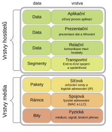
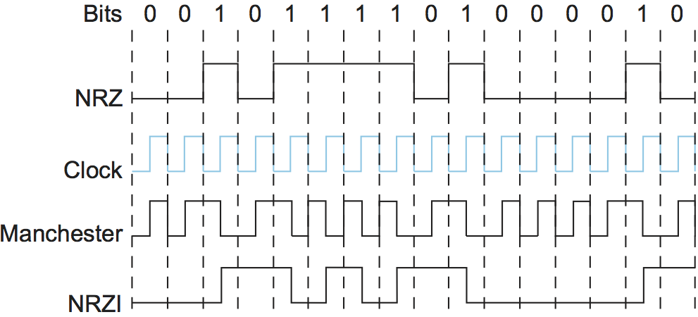
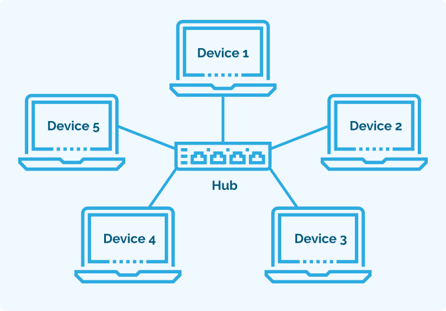
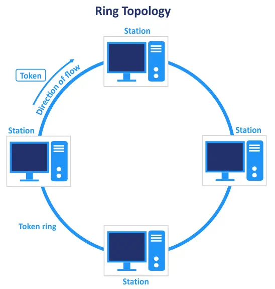
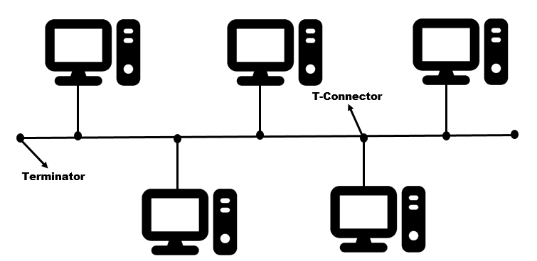
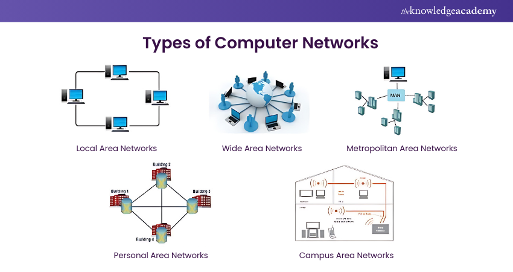

OSI 1 - Fyzická vrstva - přenosová média, přenos bitů, signály, topologie sítí, kódování dat, přenosová rychlost, detekce chyb
===

Přehled
---
Trochu matoucí otázka, nicméně lze se z ní dostat tak nějak ke všemu v první vrstvě, takže po pochopení základních principů by neměl být problém to převyprávět. Může se zdát těžká, protože těmto věcem jsme se ve výuce moc nevěnovali.       
Rozdíl mezi dvěma otázkami, které se zaobírají fyzickou vrsvou OSI modelu, může být trochu matoucí. Věci, které proberu zde, nebudu v druhé otázce opakovat.

Povídání
---
Než si začneme povídat o samotné fyzické vrstvě, zmíníme si, co je vlastně ten OSI model. Je to model síťového stacku, který se hojně používá pro výuku síťovaný nebo při referování na různé části a procesy při výměně informace mezi dvěma zařízeními. Byl to jakýsi první pokus o standardizaci síťování. Praktické implementace se více blíží modelu TCP/IP, který má vrstvy jen čtyři, oproti sedmi vrstvám model ISO/OSI.

Začínáme na první vrstvě, tedy na vrstvě fyzické. Přenosovou jednotkou jsou zde samotné bity, které mohou být reprezentovány různymi formami signálu. Bit je základní jednotka informace, může nabývat dvou hodnot, buď 1, nebo 0. Na první síťové vrstvě rozlišujeme několik druhů signálu, přes které lze informaci přenášet. Naprosto typické jsou signály elektrické např. pomocí přes měděného kabelu. Na místech, kde je potřeba informaci přenášet přes velké vzdálenosti, se můžete setkat se signály optickými. Třeba optické kabely, které jsou nataženy na dně oceánů a propojují země mezi sebou. Posledním běžným způsobem přenosu informace je přenos bezdrátový, skrz rádiové vlny.           
Každý z těchto způsobů má své pro a proti, svůj způsob přenosu informace. O detailech bezdrátového přenosu se budeme bavit v otázce o bezdrátových sítích. Kromě různých signálů existují i různé způsoby dekódování signálu. Každý počítač je k síťi připojen pomocí síťové karty. Ta se, mimo jiné, stará právě o proměnu dat do signálů, které lze přenášet pomocí fyzických médií. Médiem přenosu může být třeba právě ten měděný kabel, vzduch v případě rádiových vln nebo optický kabel v případě optických signálů.     
Signály musí být před přenosem na společném médiu nějakým způsobem kódovám. Nebudeme zde kódování probírat do hloubky, nicméně pro lepší pochopení si kódování ukážeme na názorném příkladu. Tzv. Manchesterské kódování pracuje tak, že pokud jde signál, třeba právě na nějakém kabelu, z nižšího napětí na vyšší, je dekódován jako 0, v opačném případě, tedy z vyššího na nižší, je dekódován jako 1. Vyšší a nižší signál nemusí být nutně napětí na drátu, nicméně zde je nejjednoduší si ho tak představovat. Obrázek vám snad pomůže k lepšímu pochopení. Při příjimání signálu jsou důležité nějaké hodiny, které diktují, kdy z média číst data.

Určitě jste již někde, třeba při vybírání internetováho tarifu, narazaili na rychlosti připojení. Třeba 100Mb/s. Vystvětlíme si teď, co tohle číslo vlastně znamená. Je to nejvyšší objem dat, který bude možné přenést za nějakou jednotku času, typicky za sekundu. Anglicky bandwidth, jednotka bps (bits per second).       
Bandwidth ale rozhodně neukazuje reálnou kapacita sítě, ta je pak určená tzv. throughputem, tedy objemem dat, který přes síť opravdu projde. Bandwidth je tedy pouze takové teoretické maximum. Existuje ještě goodput, který určuje, kolik opravdových, užitečných dat projde sítí za nějakou časovou dobu, tedy dat bez různých síťových overheadů. Zajímavostí je, že bandwidth pro tzv. downstream komunikaci, tedy komunikaci z internetu k nám, bývá vyšší než pro upstream komunikaci. Poskytovatelé internetu totiž počítají s tím, že z internetu toho více stahujeme, než uploadujeme. Frekvenční pásmo pro downstream je tedy větší než to pro upstream. Klidně si udělejte speedtest a uvidíte sami.        
Samotnou rychlost připojení pak určuje latence, tedy jak dlouho trvá signálu se dostat z jednoho místa na druhé.        
Otázka zmiňuje topologie sítí, tak si jich pár představíme. Topologie sítě je prostě způsob spojení jednotlivých zařízení mezi sebou. V dnešní době jsem však nenarazil na žádnou jinou naž na hvězdicovou topologii. Ještě předtím si vysvětlíme pojem duplex a half-duplex. Kabely, které podporují duplexní mód, dovedou ve stejnou dobu přenášet data oběma směry. To uvidíme v příští otázce. Half-duplex je starší technologie a znamená, že spojení dovede přenášet v jednu chvíli data pouze jedním směrem.       
První z topologii je zapojení hvězdicové. Využíva switche, nebo hubu, který je centrem spojení a stárá se o odesílání dat. Této topologie hojně využívá Ethernet, což je protokol linkové vrstvy, které docela efektivně ovládl většinu internetu. Právě o něm budeme hovořit v příští otázce. Výhodou této topologie je, že pokud se nějaké zařízení rozbije, funkčnost topologie to nijak nenaruší. Nicméně cetrální hub, switch je single point of failure, který, pokud vypadne, způsobí výpadek všech zařízení na něj napojených. Jenom taková poznámka, pokud využijeme v centru topologie hub, ačkoliv nazývano hvězdicovou topologií, hub je pouze takový opakovač, podporuje pouze half-duplex a v takové sítí je potřeba CSMA/CD, které si objasníme u busu. Huby se již dnes nepoužívají a byly plně nahrazeny chytřejšími, rychlejšími a lepšími switchy.

Další možnou topologíí je kruhová. V dnešní době je již zastaralá, takže se jí nebudeme moc zabývat. Výpadek jediného zařízení způsobil, že celá síť přestala fungovat. To bylo dáno tím, že směr proudění dat byl pouze jeden.

Posuneme se k topologii, které se říká mesh. Ta se spíše než u osobních počítačů využívá u větších instalací, třeba mezi routery. V tomto zapojení je každé zařízení spojeno se všemi dalšími. Exitují i variace, kdy není nutně každé zařízení zapojeno s každý, tzv. partial mesh. Nenechte se prosím vystrašit pentagramem na obrázku, počítače nezačaly vyznávat satana, je to pouze výsledek faktu, že zařízení je pět, tím pádem i cípů meshe je pět.

Poslední topologií, na kterou se tu podíváme, je topologie bus. V této topologii nastává hned několik problému, proto se u ní zastavíme trochu déle. Všechny počítače jsou tu spojeny k jednomu páteřnímu kabelu. Ten je na otevřených koncích speciálně zakončen, aby se signál neodrážel. Pokud se nějaký z konců poškodí, celá topologie přestává fungovat. Stejná věc nastane, když se nějaký z počítačů odpojí a kabel zůstane otevřený. Dalším problémem je, že společné médium může používat pouze jedno zařízení v jeden čas. Proto byl vyvinut CSMA/CD (Carrier Sense Multiple Access/ Collision Detection). Pokud zařízení detekuje kolizi, počká náhodnou dobu, než pošle své data znovu. Trochu terminologie, pokud máme nějakou část sítě, na které mohou probíhat kolize mezi daty, je to jedna kolizní doména .. aspoň hrubě přeloženo z angličtiny.

Povíme si teď něco, co není v této otázce přesně specifikováno, nebo alespoň já to tam nevidím. To jsou pojmy LAN, WAN, PAN a MAN. Budeme je používat hojně ve všech ostatních otázkách, takže se bude hodit znát jejich význam.        
LAN je Local Area Network. Takže třeba síť, kterou máte doma nebo kterou máme my na škole.      
WAN je Wide Area Network. WAN spojuje sítě napříč zeměmi nebo pobočkami firmy. Většinou se zde využívá služeb poskytovatelů připojení. Samotný internet je největší WAN síť.        
PAN nemá nic společného s pánvičkou, ale je to Personal Area Network. Typicky point to point, třeba Bluetooth spojení mezi vaším mobilem a sluchátky. Nebo sítě mezi různými zařízení IoT (Internet of Things). Třeba váš hotspot také tvoří PAN.     
MAN je, jak už název vypovídá, samozřejmě ta nejmužnější síť. Je to taková síť, která propojuje zařízení v nějaké metropolitní oblasti, třeba ve městě, několika městach, vesnicích. Proto Metropolitan Area Network.      
Existuje ještě tzv. CAN, Campus Area Network. To by měla být síť, která funguje v nějaké omezené oblasti, třeba v budovách vysoké školy.        
Realita je, že kromě LAN a WAN je tohle jenom bullshit teorie, ale k maturitě se hodí vědět, že něco takového jako třeba fuckin CAN existuje, abyste se tam pak nedivili, že po vás chtějí objasnit, jak vypadá plechovka nebo pánvička. Nedejbože abyste se tam svlékli, kdyby chtěli vědět, jak vypádá MAN.

Posledním tématem, které probereme v této otázce, je detekce a náprava chyb. Při putování bitů po médiu samozřejmě mohou vznikat chyby. Třeba vlivem EMI a RFI, o kterých si povíme v příští otázce. Z tohoto důvodu je potřeba chyby detekovat a popř. opravit. Toto téma může být velmi komplikované, hlavně v případě opravy chyb, my si uděláme jenom rychlé intro, to by snad mělo k maturitě stačit.      
Nejjednodušší způsob detekce chyby je tzv. parita. Třeba za každým zaslaným bytem se přidá jen bit parity, tedy 1, nebo 0. Tento bit říká třeba, že pokud by v bytu měl být lichý počet 1, paritní bit bude 0. Tomu se říká lichá parita. Sudá funguje obráceně. Lze ji využít třeba na sériové lince. Pokud tedy nastane v bytu chyba, nějaký bit se změní, pomocí parity ho lze detekovat. Ale co když se změní dva stejné? Pak máme smůlu. Takováto jednodimenzionální parita také nedokáže žádnou chybu opravit.        
Další možností jak detekovat chyby je třeba checksum, tedy kontrolní součet, který si pak přijímající zařízení zkontroluje.     
V dnešní době se pro detekci chyb hojně používá např. CRC (Cyclic Redundancy Check).

Materiály
---
Computer Networks: A Systems Approach - https://book.systemsapproach.org/direct/problem.html        
TechsavvyProductions - OSI layer 1 - https://www.youtube.com/watch?v=lsky_bgZoKA        
Libor Dostalek - Fyzická Vrstava - https://www.youtube.com/watch?v=ZScMXyQSFfo      
Cisco ITN - Module 4 and 6 - https://netacad.fit.vutbr.cz/wp-content/uploads/ccna/itn/lectures/p2-m4-m6-m7.pdf      
Techquickie - EMI as Fast as Possible - https://www.youtube.com/watch?v=AHbrVad86xw     
Astrodyne TDI - What is EMI? What is RFI? - https://www.youtube.com/watch?v=g3RBb8wmB2E     
Princip přenosu informací - https://publi.cz/books/86/02.html       
PowerCert - Network Topologies - https://www.youtube.com/watch?v=zbqrNg4C98U        
Neso Academy - Error Detection - https://www.youtube.com/watch?v=EMrY-8m8D1E        
Geeksforgeeks - CSMA/CD - https://www.geeksforgeeks.org/collision-detection-csmacd/     
Jim Kurose - Error detection and correction - https://www.youtube.com/watch?v=x-rQ3RiI7I0&t=35s