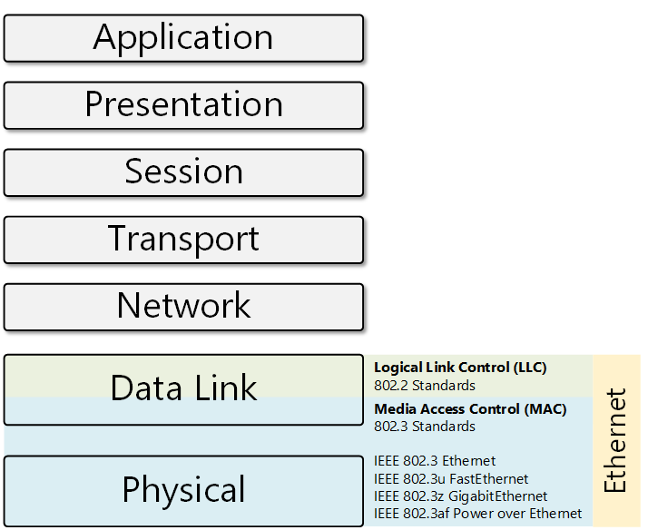
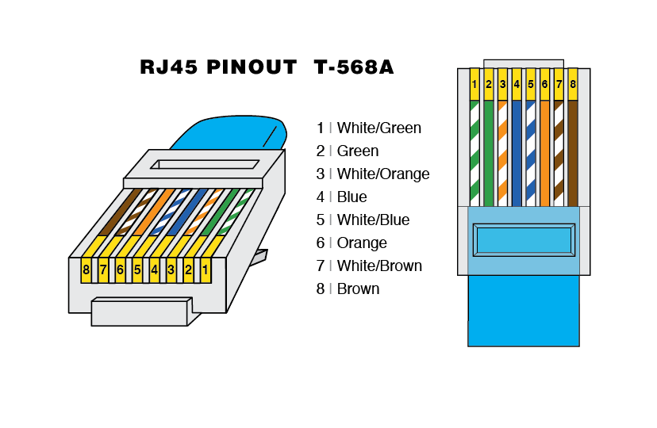
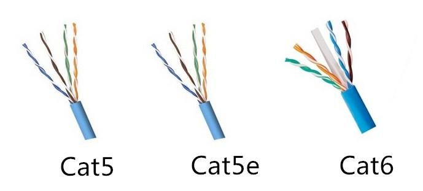
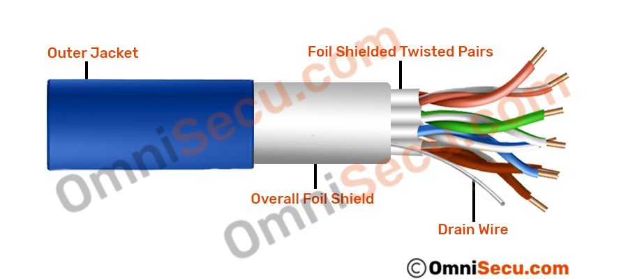
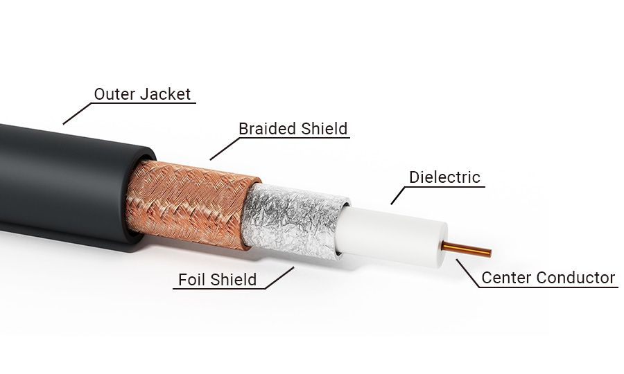
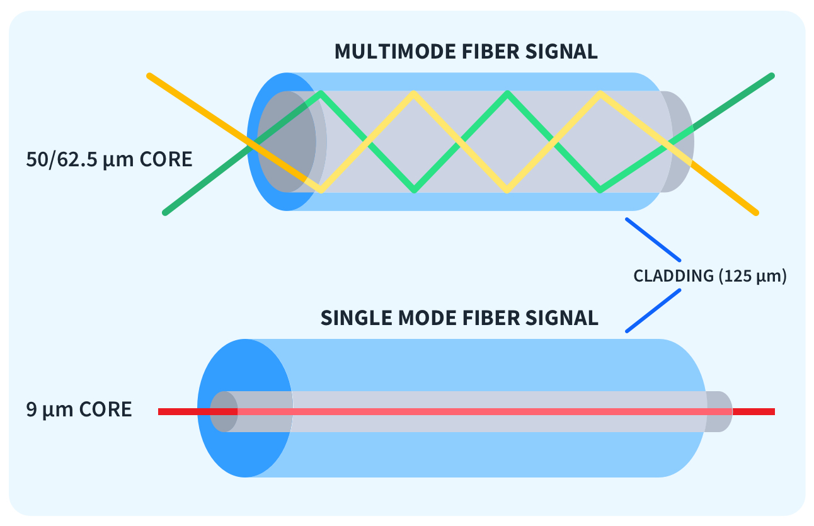

OSI 1 - Fyzická vrstva - Ethernet základní principy, standardy, strukturovaná kabeláž, optika, konektory, přenosové rychlosti
===

Přehled
---
Velmi podobná předchozí otázce, podíváme se zde více konkrétně na kabeláž a Ethernet. Všechny pojmy, které zde budu využívat, najdete vysvětlené v předchozí otázce. Řekneme si také něco k ostatním protokolům, které se používají na této vrstvě.

Povídání
---
Začneme tím, co to vlastně ten Ethernet je. Je to rodina protokolů, které se hojně využívají na sítích LAN. Jsou originálně definovány standarty IEEE 802.2 a 802.3. Lze ho rozděli to dvou podvrstev. LLC a MAC. O obou si něco povíme a zkusím vám vysvětlit, jaký je mezi nimi vlastně rozdíl. Jak vypadá Ethernetový rámec a jeho funkce na druhé síťové vrstvě si objasníme v dalších otázkách, teď se zaměříme pouze na jeho definici a spojení s kabely.     
LLC (Logical Link Control) je podvrstva, která se již nachází na druhé síťové vrstvě. Zkusím ji vysvětlit co nejjednodušeji, aby byl rozdíl mezi LLC a MAC podvrstvou zřejmý, protože jsem na spoustě zdrojů našel různé informace, které si často protiřečily. LLC je implementována softwárově, komunikuje s vrstvami nad ní a dává jim tak možnost komunikovat přes stejné médium. Do Ethernetového headru přidává především typ protokolu, který je v rámci obsažený. Dovoluje tedy různým protokolům existovat v jednu chvíli na stejné síti. Provádí také flow control a podobné kravinky, které nebudeme řešit.      
MAC podvrstva je implementována hardwarově. Přidává MAC adresy do Ethernetového headru, kalkuluje pro něj také FCS. Řeší CSMA/CD, stará se o využití správného protokolu na základě rychlosti spojení.      
Ano, existují různé standardy na základě rychlosti připojení. Netřeba se jimi příliš trápit.

Pro orientaci a upevnění pochopení si představíme pár jiných protokolů na první síťové vrstvě. Např. Wi-Fi, o kterém si povíme v otázce o bezdrátových sítích. USB lze také chápat jako protokol první vrstvy. Bluetooth je také hezký případ. Ethernet je tak trochu speciální v tom, že zasahuje i do linkové vrstvy. V linkové vrstvě funguje ještě třeba např. PPP (Point to Point Protocol). Nebudeme si zde žádný z nich rozebírat, nemáme na to čas.         
Pozn.: Výrazy standard a protokol zde využívám tak nějak se stejným významem. Protokol je svým způsobem standard, nebo bývá určený více standardy.      
Tak, teď už se můžeme plně vrhnout do kabeláže. Nejběžněji se setkáte s klasickými měděnými kabely. Existuje jich několik typu, my si zmíníme ty, které jsou zmíněny v Cisco CCNA ITN. Prvním z nich je náš dobře známý UTP (Unshielded Twisted Pair). Je to kabel, který má typicky osm vodičů, vždy zkroucené pod dvou. Kvůli něčemu, čemu se říká crosstalk, musí být jednolivé kabely vždycky zkroucené trochu jinak. Crosstalk je fenomén, kdy data z jednoho kabelu kvůli EMI způsobené samotným kabelem unikne do jiného kabelu. Nejsme zedníci, takže nemusíme vědět podrobnosti takových dějů. Stejně tak si nebudeme vysvětlovat pinout konektoru RJ-45. To je konektor, který se používá k zakončení UTP. Stačí nám vědět, jak vypadá a jak zhruba jsou na něj napojeny jednotlivé kabely. RJ-45 má osm zdířek, do kterých se jednotlivé kabely nacpou a pak se pomocí speciálních kleští dorazí tak, aby správně doléhaly na kontakty v konektoru.      
Exitují dva standardy zapojení kabelů do konektoru, T-568A a T-568B. Dříve záleželo na tom, jaký jste vybrali. Kabelu se stejnými standardy na obou koncích se říkalo straight-through a využíval se k připojení hosta k síťovému zařízení, třeba switchy. Pokud měl kabel na každém konci jiný standard, hovořilo se o něm jako o cross-over a byl určený k zapojení dvou síťových prvků mezi sebou.       
Dnes už se doporučuje dělat každý kabel jako straight-through, protože síťové prvky dnes implementují MDI-X, Auto Medium Dependent Interface Crossover. To samo dovede rozpoznat, jaký typ konektoru je použit.         

Kabel samozřejmě nelze vést do nekonečna, protože má určité ztráty síly signálu. Doporučená maximální vzdálenost pro UTP bývá 100 metrů.   
UTP má ještě různé kategorie. Typická je kategorie 5 a 5e, popř. kategorie 6. Detaily o jednotlivých kategoriích si můžete najít sami.  

Dalším možným kabelem je STP (Shielded Twisted Pair). Tento typ kabelu má jeden zásadní rozdíl .. má speciální vrstvu, která chraní kabely před EMI/RFI. Mohou být také terminovány konektorem RJ-45, někdy se využívá také RJ-48.      

Posledním typem kabelu je koaxiál. Kovové stínění funguje jako jeden drát, vnitřní vodič jako druhý. Existují různé konektory. Má své využití v připojení antén a kabelového internetu, ale my se o něj nemusíme moc starat. Důležité je jen vědět, že existuje.

Vrhneme se teď na optické kabely. Tím to zakončíme, na bezdrátové sítě se podíváme až v příslušné otázce. Optické kabely nejsou tak běžné, protože jsou mnohem dražší. Dovedou přenášet informace na dlouhé vzdálenosti bez ztráty kvality a jsou kompletně imunní vůči EMI/RFI. Jsou vyrobené ze skla, velmi čistého samozřejmě. Využívají LED, nebo laser k vytvoření signálů v kabelu.       
Existují dva typy, Single-Mode a Multimode. Single-mode využívá tenkého jádra a využívá drahé lasery. Využívá se většinou na dlouhé vzdálenosti. Multimode má jadro tlustší, využívá LED pod různými úhly. Dovede se dostat až na rychlost 10Gbps.

Optické kabely jsou většinou po dvou, jeden pro upstream a jeden pro downstream. Nachází své využítí v páteřních sítích, velmi rychlých připojeních domácností, podmořské kabely, které propojují země ... 

Materiály
---
Cisco ITN - Module 4 and 6 - https://netacad.fit.vutbr.cz/wp-content/uploads/ccna/itn/lectures/p2-m4-m6-m7.pdf      
LLC Podvrstva podle Cisca - https://www.cisco.com/c/en/us/support/docs/ibm-technologies/logical-link-control-llc/12247-45.html      
PowerCert - Network Connectors explained - https://www.youtube.com/watch?v=ktTtAQIvYkg      
PowerCert - Ethernet Cables - https://www.youtube.com/watch?v=_NX99ad2FUA       
Jeremy's IT Lab - Interface and Cables - https://www.youtube.com/watch?v=ieTH5lVhNaY        
Jeremy's IT Lab - OSI Model and TCP/IP Suite - https://www.youtube.com/watch?v=t-ai8JzhHuY
