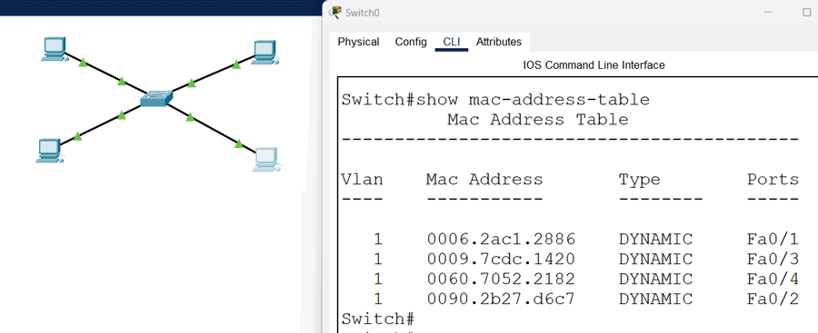
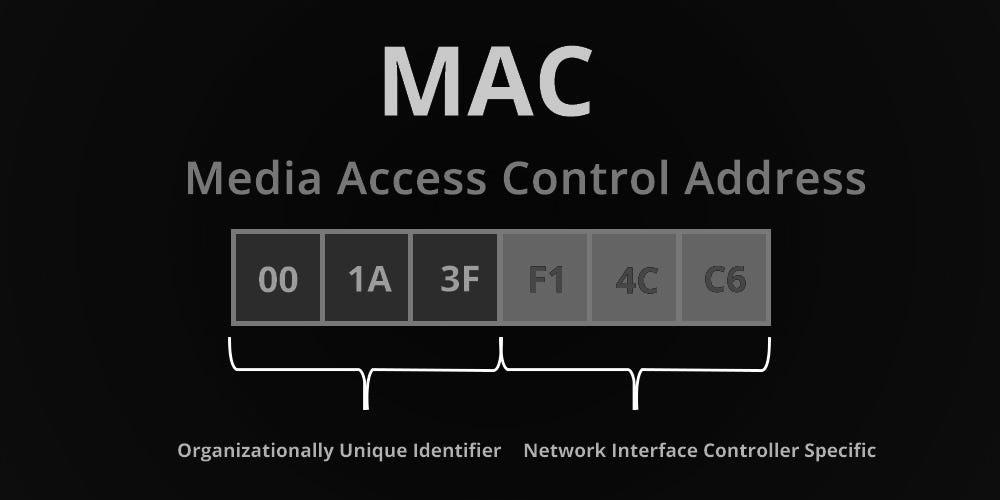
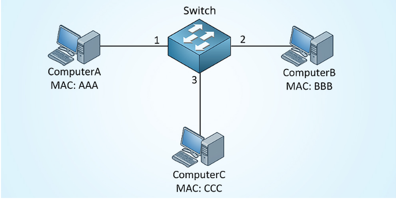

OSI 2 - Linková vrstva - Přepínače, rámce, adresování, kolize, detekce a oprava chyb, MAC, řízení toku dat
===

Přehled
---
Velmi zvláštně zadaná otázka. Kombinuje vrstvu 2 s vrstvou 1. Spoustu věcí, jsme již probrali v předchozích otázkách na první síťovou vrstvu, takže je zde nebudu opakovat.

Povídání
---
Začneme věcmi, které najdete v předchozích otázkách. Kolize jsme již probrali, konkrétně **CSMA/CD**. **CSMA/CA** budeme probírat v otázce o bezdrátových sítích. **Detekci a opravu chyb** jsme si také již zmínili v předchozích otázkách.        
Takže, čeká nás vhled do druhé síťové vrstvy. Na této vrstvě lítá něco, čemu se říká **rámce**. Teď záměrně trochu předběhnu a vysvětlíme si pár zásadních věcí, které se řeší především v další otázce, nicméně bez nich by mohlo být velmi složité pochopit význam **ethernetového headeru** a **adresování**. Mějme nějaké zařízení, třeba stolní počítač. Když chce něco poslat jinému počítači na síti, začne zpravidla u dat, která chce poslat. Ten zabalí do přislučného headeru protokolu aplikační vrstvy, třeba SSH, SMTP, HTTP. Ten je pak zabalen do headeru transportního protokolu, TCP, nebo UDP. Ten pak opět do protokolu síťové vrstvy, typicky IP. Této "konstrukci" se říká **packet**. Tento packet pak ale ještě musí být zabalen do **ethernetového headeru** a **traileru**. Celému tomuto procesu se říká **zapouzdření**. Data postupně zapouzdřujeme do různých headerů.        
V tuto chvíli přichází na řadu vrstva první, která to celé převede do formátu, který lze přenést po nějakém médiu, třeba po měděném kabelu. Pro zajímavost, data s TCP headrem se nazývá **segment**. Samozřejmě rámce mají nějakou maximální velikost payloadu, než je třeba je rozdělit na několik rámců. Může být proměnná, ale typicky se uvádí 1500 bytů.      
Na lokální síti funguje zařízení, které se jmenuje **přepínač**, anglicky switch. To rozesílá rámce mezi zařízeními. Když na nějaký port switche přijde rámec switch udělá následující. Podívá se do své **MAC address table**, někdy také **CAM table**, je to v podstatě to samé. V této tabulce jsou uložené MAC adresy, které jsou vždy spojené s konkrétním portem na zařízení. Switch se podle nich rozhoduje, kam rámec pošle. Pokud se MAC adresa v nějakém záznamu v této tabulce shoduje s MAC adresou cílového zařízení v příchozím rámci, vyšle ji příslušným portem. Takovém rámci se říká known unicast. Pokud v tabulce žádný záznam nenajde, vyšle rámec všemi porty kromě portu, kterým rámec do switche přišel. Takovému rámce se říká unknown unicast.       
Adresy v CAM tabulce samozřejmě nejsou uchovávané napořád, pokud je záznam dynamický, je pod nějaké době smazán, typicky třeba po 5 minutách. Pokud na port, se kterým je tento záznam asociován, opět přijde rámec s příslušnou MAC adresou, timer je resetován. Pokud však má takový rámec jinou MAC adresu, je záznam MAC adresa záznamu přepsána.

Teď jedna velmi důležitá věc, kterou je potřeba pochopit. Určitě už znáte něco, čemu se říká IP adresa, ačkoliv tu si teprve probereme. Každé zařízení, které na síti pracuje, ji typicky má, aby mohlo komunikovat se zařízeními v jiných sítích. **Switch nic jako IP adresu nezná**! To je potřeba si vtlouct do hlavy. Ano, může mu být přidělena, ale to pouze pro účely jeho správy. Při přepínání rámců o ní nemá sebemenší ponětí. Dívá se jen a pouze na ethernetový header a trailer. Samozřejmě nebereme v potaz existenci L3 switche, o těch si také povíme, nicméně klasický switch se rozhoduje jen a pouze na základě MAC adres, funguje na druhé síťové vrstvě. Můžu vám garantovat, že pokud někdo z vás u maturity v souvislosti se switchem začně mluvit o IP adresách, může se těšit zase v září na repete.     
Dobře, switch se rozhoduje podle MAC adres, got it, ale co to ta **MAC adresa** vlastně je? Dobrá otázka, to si právě teď vysvětlíme. Můžete o ní slyšet i pod různými jinými akronymi, třeba fyzická adresa, BIA (Burned-in Adress), hardware address, nicméně všechny referují na tu samou věc. MAC adresa se zapisuje v hexadecimální soustavě, tedy v šestnáctkové. Nebudu ji tu znovu vysvětlovat, jestli ji ve čtvrtém ročníku neumíte, můžete rovnou přestat číst, protože nemáte žádnou šanci odmaturovat. MAC adresa vypadá nějak takto *B4-AB-CD-12-43-C1*. Má 48 bitů, to zajišťuje přes sto trilionů možných adres. Měli by být globálně unikátní, nicméně to nemusí platit. Výrobci často MAC adresy, které použili kdysi, využívají znovu. Protože se MAC adresy využívají na úrovni lokální sítě, není to takový problém. Pokud byste ale měli dvě zařízení se stejnou fyzickou adresou na jedné síti, můžete se těšit na pěkné problémy. Když se vám to ale náhodou opravdu stane, nezoufejte. Ačkoliv je MAC adresa opravdu vypálena někde ve vaší síťové kartě, lze ji softwarově změnit. Toho hojně využívají i útočníci, takže **nikdy** nevěřtě žádné ochraně založené na unikátnosti MAC adresy.      
MAC adresu lze rozdělit do dvou částí. První je tzv. **OUI** (Organizationally Unique Identifier). Ten si může koupit nějaká firma a dostane blok MAC adres, který může svým zařízením dávat. OUI je velký 24 bitů. Na druhou část tedy zbývá také 24 bitů. To je samotná uživatelská část, nemá žádná spešl pravidla. OUI ale není tak úplně levná záležitost, firma jich může nakoupit i více. Nicméně je mnohem jednoduší prostě znovu použít adresy, které firma vypálila do zařízení třeba před 10 lety. Proto se může stát, že dvě zařízení budou mít stejné MAC adresy. Nebo také může nastat chyba a firma vypálí do několika zařízení stejnou MAC adresu. Jen tak ze zajímavosti, slyšel jsem příběh o tom, že někdo koupil X zařízení najednou od jedné firmy a asi kvůli podobné chybičce měla všechna stejnou MAC adresu .. to docela nasere. Opět jen tak ze zajímavosti, alespoň podle internetu, pokud bychom chtěli, aby byly MAC adresy globálně unikátní, budou nám stačit plus minus to roku 2100.         
Na závěr, **MAC adresa unikátně identifikuje zařízení na linkové vrstvě**, tedy druhé síťové vrstvě (L2).

Ještě předtím, než se dostanem k ethernetovému headeru, zmíníme se o dvou způsobem přepínání. Je to tzv. store-and-forward a cut-through. Pokud implementujeme první z nich, switch vždy nejdříve přijme celý rámec, zkontroluje, zda vše sedí, pokud ne, dropne ho, v opačném případě ho pošle dál. Implementujeme-li druhý z nich, switch se podívá pouze na MAC adresu cílového zařízení a rámec rovnou přepne, bez kontroly. To je rychlejší, nicméně riskujeme přepínání poškozených rámců.

Objasníme si teď **strukturu ethernetového headeru**. Budeme brát v podaz naprosto minimální header, bez VLANu, ty probereme v dalších otázkách.

| Preamble | SFD    | Destination MAC | Source MAC | Ethertype or length | Payload       | FCS     |
| -------- | ------ | --------------- | ---------- | ------------------- | ------------- | ------- |
| 7 bytes  | 1 byte | 6 bytes         | 6 bytes    | 2 bytes             | 42-1500 bytes | 4 bytes |

První pole o velikosti 7 bytů, je **preambule**. Ta slouží pro synchronizaci hodin. Všech sedm bytů vypadá takto *10101010*.        
Hned po něm následuje **SFD** (Start Frame Delimeter). Vypadá podobně jako část preambule, má ale jednu odlišnost, poslední bit je *1*. Je to tedy *10101011*. Tím dává signál, že končí preambule a následuje zbytek rámce.        
Dále následuje **MAC adresa cílového zařízení**.        
Ihned po ní je **MAC adresa zařízení, které rámec odeslalo**.       
Další je trochu speciální pole,. Pokud je jeho hodnota menší, nebo rovna 1500, indikuje velikost payloadu v bytech. Pokud je však větší, indikuje typ síťovho protokolu, který se nachází v payloadu. Není pro nás důležité vědět, v jakých případech se využívá co.     
Následuje samotný **payload**, tedy data.       
Poslední pole se nachází v tzv. **ethernet traileru**, protože je až za payloadem. Nazývá se **FCS** (Frame Check Sequence) a využívá se pro detekci a opravu chyb. Využívá CRC, o kterém jsme si říkali v minulých otázkách.       
První dvě pole, preambule a FCS, se často neberou jako část ethernetového headeru. Bez nich je tedy velký nějakých 18 bytů. **Minimální velikost rámce je 64** bytů (pokud je menší, rámec je zahozen), pokud bereme v potaz 18 bytů headeru, je **nejmenší velikost payloadu 46 bytů**. Pokud by náhodou data nebyla dost velká, přidává se tzv. **padding**. To jsou byty plné nul, *00000000*.

Materiály
---
Jeremy's IT Lab - Ethernet LAN Switching (Part 1) - https://www.youtube.com/watch?v=u2n762WG0Vo     
Jeremy's IT Lab - Ethernet LAN Switching (Part 2) - https://www.youtube.com/watch?v=5q1pqdmdPjo        
Jeremy's IT Lab - Switch Interfaces - https://www.youtube.com/watch?v=cCqluocfQe0        
David Tarnoff - Cyclic Redundancy Check - https://www.youtube.com/watch?v=6r1qymoQatk