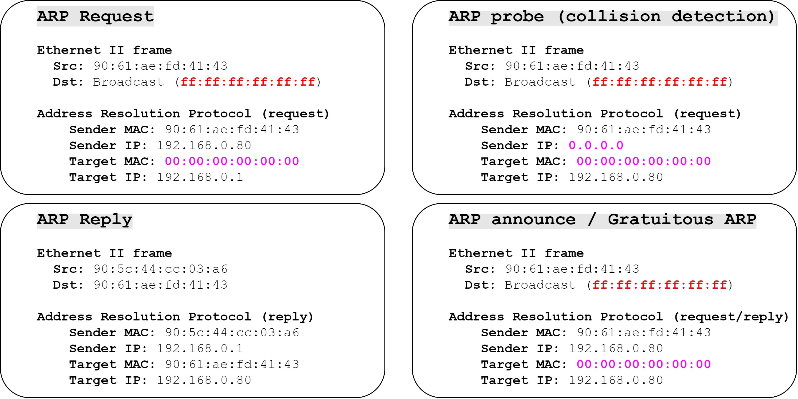
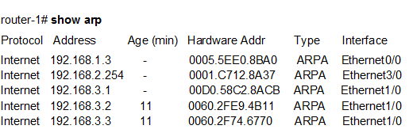
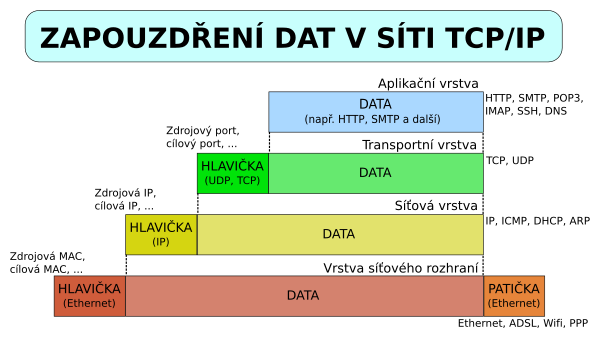

OSI 2 - Linková vrstva - ARP, MAC, vztah mezi rámcem a paketem, zapouzdření
===

Přehled
---
Velmi pěkná otázka, přeji hodně štěstí, abyste ji dostali, protože jednodušší otázka tu snad ani není. Většinu konceptů jsme si již vysvětlili v předchozí otázce, takže zde budu mluvit pouze o ARPu.

Povídání
---
Vysvětlíme si tu velmi důležitý protokol linkové vrstvy, **ARP** (Adress Resolution Protocol). Podíváme se na to, jak probíhá výměna packetů, třeba pingu, mezi dvěma zařízeními na stejné síti.        
Počítač A chce poslat ping počítači B. Počítač A zná svou MAC adresu, zná svou IP adresu a zná IP adresu počítač B, protože mu chce poslat ping. Nu, ale nemá ponětí, jakou MAC adresu má počítač B. Vadí to? Samozřejmě. Switch umí přepínat jen a pouze podle MAC adresy, takže pokud chceme poslat ping počítači B, musíme znát jeho MAC adresu.     
Tu zjistíme právě pomocí **ARP protokolu**. Počítač A tedy vyšle do světa tzv. **ARP request**.             
Všimněte si, že v políčku Destination MAC, je uložena hodnota *FF-FF-FF-FF-FF-FF*. To je broadcast MAC adresa. ARP request je tedy rozeslán všem zařízením na síti. Zařízení, které přijme ARP request, se podívá na jeho Target IP. Pokud je to IP adresa daného zařízení, odpoví pomocí **ARP Reply**. Pokud to není jeho IP adresa, rámec zahodí.          
Počítač B se tedy podívá na rámec, uvidí, že dotaz je adresován jemu a odpoví. Odpověď je již normální unicast, protože počítač B se dozvěděl MAC adresu počítače A z políčka Source MAC v ARP requestu.
Počítač A přijme **ARP Reply** a odešle ping počítači B.                
Je možné také poslat tzv. **Gratuitous ARP**. Je je jednoduše ARP Reply, u které nepředcházel ARP Request. Je poslán jako broadcast. Zbytek funguje tak nějak podobně, počítače si uloží tento mapping to tabulky. Často se využívá např. při útocích na linkové vrstvě.

Teď trocha teorie k samotnému ARPu. Když se podívaté do WireSharku na capture nějakého ARP paketu, uvidíte za prvé, že to vůbec není paket, protože neobsahuje žádný L3 protokol, ale obsahuje pouze Ethernet II a samotný ARP. V ARPu nás zajímají čtyři pole. **Sender MAC Address**, **Sender IP Address**, **Target MAC Address** a **Target IP Address**. Ty v podstatě korespondují s polemi, které by se normálně vyskytovaly v rámci a paketu. S jednou výjimkou, tou je Target MAC address, ta je nastavena na samé nuly, jedná-li se o ARP Request.
Existuje také něco, čemu se říká **ARP table**. ARP tabulka uchovává mapování mezi IP adresou na lokální sítí a její MAC adresou. Proč? Nu, aby nemusel pokaždé probíhat proces ARP protokolu. Mapování v tabulce se samozřejmě po čase mažou, nejsou-li delší dobu použity.    

Pověnujeme se tu ještě chvíli **zapouzdření**. Říkal jsem, že počítač se dívá na packet, ne na rámec. Vskutku. Když počítač přijme ARP Request, odbalí ethernetový header a zbyde mu packet, tedy IP header a data dalších vrstev. Proto se tomu říká zapouzdření, k datům vyšších vrstev se nelze dostat, dokud neodbalíme headery těch nižších. Můžeme to vidět např. při routování, kterém se budeme bavit v dalších otázkách. Když směrovač, router, přijme rámec, odbalí L2 informace, prohlédne si paket, podle routovací tabulky se rozhodne, kam ho pošle dál a znovu ho zabalí do nového ethernetového headeru s příslušnými MAC adresami síťových karet.      
Důležitý koncept, který pochopit, je, že v rámci síťování, se router chová v podstatě stejně jako klasický počítač. Každý jeho interface má síťovou kartu, stejně jako počítač, a každá jeho síťová karta má také fyzickou adresu.

Materiály
---
Jeremy's IT Lab - Ethernet LAN Switching (Part 2) - https://www.youtube.com/watch?v=5q1pqdmdPjo        
Jeremy's IT Lab - Switch Interfaces - https://www.youtube.com/watch?v=cCqluocfQe0        